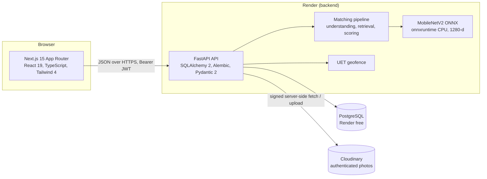
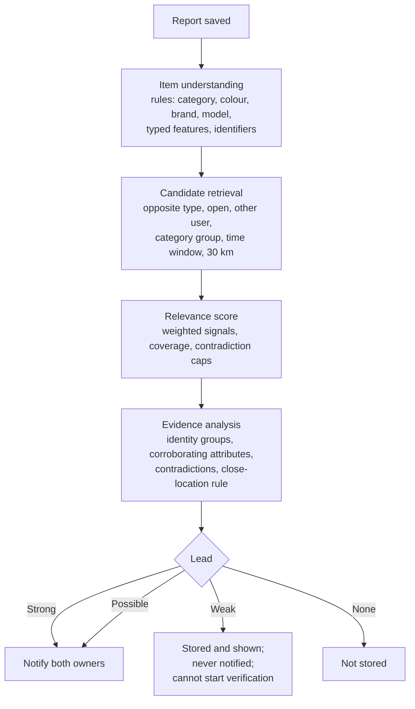
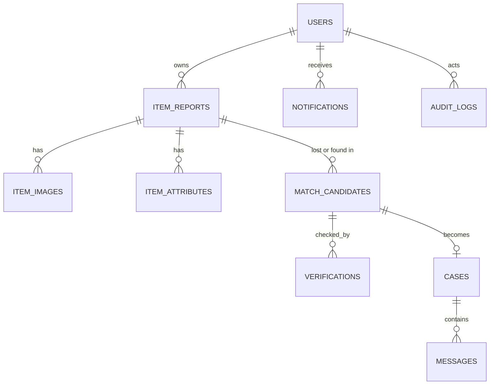

# LostLink AI: Final Project Report

**A privacy-preserving, AI-assisted lost-and-found platform for UET Lahore**

Repository: `tahashk7222/LostLinkAI` (branch `main`, last commit `2f63e7e`)
Report status: written from the repository and Git history as of 2026-10-05. Items marked *session-reported* were observed during the final deployment session but are not stored in the repository. Items marked *not verifiable from the repository* could not be confirmed from files or Git history.

---

## Title page

| | |
|---|---|
| Project | LostLink AI |
| Scope | UET Lahore Main Campus and its immediate surroundings |
| Team (roster provided by the project owner) | Taha Ahmad (AI Architect / Technical Lead); Atta Ul Islam (Lead Implementation / Integration); Abdul Wahab (Computer Vision / ML); Abdullah Khan (Frontend Developer); Fiza Azhar (Verification & Notifications); Saba Naz (Product / Research / QA / Documentation) |
| Repository authorship | All 41 commits use one Git identity, *Taha Ahmad*. Individual contributions cannot be verified from the repository. See §6. |
| Development window in Git | 2026-10-03 15:27 (plan commit `6d1c5c0`) to 2026-10-04 22:17 (commit `2f63e7e`) |

---

## Executive summary

LostLink AI helps members of the UET Lahore community find lost items and lets finders return them. It differs from a notice board in three ways.

1. **Structured matching.** Reports are parsed into structured evidence (category, colour, brand, model, typed distinctive features, identifiers, place, time). A candidate becomes a *lead* only when identity-bearing evidence agrees, not when general attributes such as colour or place agree.
2. **Privacy by design.** Exact coordinates, private details and verification answers never appear in another user's responses. Photos are re-encoded to remove metadata and are served only through short-lived, authorised URLs.
3. **Humans decide.** The AI produces a ranked suggestion with explanations. Ownership is established only when the owner answers private questions and the finder decides. An admin can moderate reports and monitor recovery, but cannot approve ownership.

The system is implemented as a Next.js frontend and a FastAPI backend with 51 HTTP endpoints, 7 Alembic migrations, a local MobileNetV2 ONNX image-embedding model running on CPU, a UET Lahore geofence, an admin portal, and an audit trail. Production targets Vercel (frontend), Render (backend and PostgreSQL) and Cloudinary (photos), all on free tiers.

**Validation evidence.** The repository contains 239 collected backend tests. The final session run observed 238 passed and 1 skipped (the skip is a CUDA test that needs a GPU). The session also observed 21 of 21 real Cloudinary checks, a frontend typecheck and production build, four browser flows on the production build, PostgreSQL 16 migrations to head `0007` with a no-op second run, and a 5-of-5 PostgreSQL API smoke test. The matching and vision metrics are *synthetic*. They describe generated test data, not real lost-and-found reports, and must not be read as real-world accuracy.

**Deployment status.** At the time of writing, the repository contains the deployment code and configuration. The live Render and Vercel deployment was not verified from the repository. The production URLs in §22 were provided by the project owner.

---

## 1. Introduction

Lost items on a university campus are usually reported to a physical office, posted on social media or never reported at all. Matching depends on people remembering to check. LostLink AI turns a lost-item report and a found-item report into structured records, then looks for compatible pairs automatically. It keeps the process inside the platform, so contact details are not exchanged until a person has confirmed ownership.

This report covers the whole project: planning, implementation, matching and computer-vision work, security and privacy decisions, debugging, testing, and deployment. It is written from the repository, not from memory.

---

## 2. Problem statement

- Finders and owners rarely know about each other's report.
- Free-text descriptions are inconsistent ("black bag", "dark backpack", "bag with keychain").
- Contact details posted publicly expose people to harassment and fraud.
- A "this looks like mine" claim is easy to make and hard to check.
- Automatic matching that treats similar-looking items as the same item sends false alerts, and each false alert wastes someone's time or exposes another person's belongings.

The project's stated position (`README.md`): *a match score is never proof of ownership, and no contact details are exchanged by the system.*

---

## 3. Project objectives

Objectives taken from `docs/IMPLEMENTATION_PLAN.md` (status table, data model, privacy and decisions sections):

1. Accept lost and found reports with photos, colour, brand, distinctive features, time and place.
2. Restrict locations to UET Lahore Main Campus and a nearby area, enforced by the backend.
3. Suggest potential matches with explanations, without claiming identity.
4. Require a private ownership check, decided by a human finder.
5. Open controlled, in-app communication only after that decision, then track recovery.
6. Give administrators moderation, monitoring and an audit trail, without access to private answers.
7. Keep private data out of other users' responses, uploads free of metadata, and secrets out of source control.
8. Run at zero cost for a hackathon demonstration.

---

## 4. Requirements

### 4.1 Functional requirements (as implemented)

| ID | Requirement | Where implemented |
|---|---|---|
| FR1 | Register and log in; update profile | `backend/app/api/routes/auth.py` |
| FR2 | Create, edit, list and delete lost/found reports | `backend/app/api/routes/reports.py` |
| FR3 | Attach up to 4 photos per report | `reports.py` (`MAX_IMAGES = 4`) |
| FR4 | Choose a predefined UET place, or a GPS/map point inside the area | `services/location.py`, `geo/geofence.py`, `geo/uet_lahore.json` |
| FR5 | Automatic and on-demand matching | `ai/orchestrator.py`, `ai/matching.py` |
| FR6 | Owner starts a private verification, answers questions | `api/routes/matches.py` |
| FR7 | Finder accepts or rejects the claim | `matches.py` (`/verify`) |
| FR8 | Finder confirms whether they still have the item | `api/routes/cases.py` (`/possession`) |
| FR9 | In-app messages inside an open case | `cases.py` (`/messages`) |
| FR10 | Recovery and closure | `cases.py` (`/status`) |
| FR11 | In-app notifications | `services/notifications.py`, `api/routes/notifications.py` |
| FR12 | Admin dashboard, moderation, verification and case monitoring | `api/routes/admin.py`, `frontend/src/app/admin/` |
| FR13 | User flags for abusive content | `api/routes/flags.py` |

### 4.2 Non-functional requirements

| ID | Requirement | Evidence |
|---|---|---|
| NFR1 | Upload limit 5 MB; JPEG, PNG or WebP only | `services/storage.py` (`ALLOWED_TYPES`, `MAX_UPLOAD_MB`) |
| NFR2 | EXIF and GPS removed from stored photos | `storage.py` (`flatten_for_storage`, re-encode) and `tests/test_vision.py` |
| NFR3 | Object-level authorisation on report, match, case and message endpoints | `api/deps.py`, route guards; `tests/test_reports_security.py`, `tests/test_verification_privacy.py` |
| NFR4 | Zero runtime cost | §23 |
| NFR5 | Explainable matching: each reason stored as evidence | `matching.py`, `match_candidates.evidence` (migration 0003) |
| NFR6 | No external paid AI service | `docs/IMPLEMENTATION_PLAN.md` ("no external AI for now"); `docs/VISION.md` §14 ("No API keys or paid services are used") |

---

## 5. Initial planning

The Phase 0 plan (`docs/IMPLEMENTATION_PLAN.md`, committed as `6d1c5c0`, 2026-10-03 15:27) records these starting conditions and decisions:

- The GitHub repository existed but was empty.
- The development machine had no Docker, PostgreSQL or pgvector. Local development would use SQLite, and production would use PostgreSQL.
- **Team decision: no external AI for now.** Every AI module was to be local and deterministic, behind a provider interface so a learned model could be swapped in later.
- Human-in-the-loop verification: the AI score is advisory and the finder confirms.
- Local file storage behind a `StorageService` interface (S3 later).
- In-app notifications first, with the email sender as a log-only interface.
- Alembic migrations at startup.
- Geographic scope: the UET campus polygon from OpenStreetMap, with a 500 m buffer for the nearby zone. The plan forbids inventing coordinates: unmapped places were left out until verified.

The plan's intended journey was: **Report → Match → Verification → Possession decision → Recovery**, with the state machines in §4 of the plan. The implemented journey is described in §24.

### 5.1 Design evolution visible in the repository

| Stage | Evidence | What changed |
|---|---|---|
| Plan only | `6d1c5c0` | Architecture and decisions recorded before code |
| First full backend and frontend | `9d38498` (16:10), `92315cd` (16:17) | Auth, reports, matching pipeline, verification, cases, admin in one commit |
| Location and geofence | `d6c7939` (17:55) | UET boundary, places, migrations `0001`–`0002` added, `migrate.py` |
| Matching evaluation | `69b7240` (19:44) onwards | A synthetic dataset and harness before the matching changes |
| Identity-based matching | `4c2c27f` (20:48), `98fd34e` (22:18), `3b5605f` (23:23) | v2, then v3, then safeguards |
| Admin portal | `7209931` (12:40 on 10-04) to `06d3b89` (12:48) | Moderation, recovery monitoring |
| Verification privacy and possession | `66e43b0` (16:32 on 10-04) | Finder no longer sees owner answers; possession confirmation |
| Computer vision | `a9c0ba4` (18:31 on 10-04) | Learned image embeddings |
| Deployment | `1f989ee` (22:09), `2f63e7e` (22:17) | Cloudinary storage, production guard, migration fix |

---

## 6. Team and responsibilities

### 6.1 Roster

The roster below was provided by the project owner for this report. The repository does not list team members.

| Member | Role (roster) | Module boundary in the repository | Repository evidence |
|---|---|---|---|
| Taha Ahmad | AI Architect / Technical Lead | Matching core (`ai/matching.py`, `understanding.py`, `orchestrator.py`), per the handoff's "matching author" | Every commit is under this Git identity |
| Atta Ul Islam | Lead Implementation / Integration | Integration across modules | *Not verifiable from the repository* |
| Abdul Wahab | Computer Vision / ML | "Computer Vision" module: photo handling and image similarity (`DEVELOPER_HANDOFF.md` §10) | Branch `feature/wahab-cv-ml` (fully merged, last commit `a9c0ba4`); commit authored under the single identity |
| Abdullah Khan | Frontend Developer | "Frontend / UI" module (`DEVELOPER_HANDOFF.md` §10) | *No frontend-attributed commits; not verifiable from the repository* |
| Fiza Azhar | Verification & Notifications | "Verification and notifications" module (`DEVELOPER_HANDOFF.md` §10) | Branch `feature/fiza-verification-recovery` (fully merged, last commit `66e43b0`); commit authored under the single identity |
| Saba Naz | Product / Research / QA / Documentation | "QA and documentation" module (`DEVELOPER_HANDOFF.md` §10) | *No QA-attributed commits; not verifiable from the repository* |

### 6.2 Limits of this evidence

- All 41 commits share one author name and email. Branch names suggest who worked on what, but the commits do not record it.
- The handoff describes module boundaries for parallel work. It does not record who did the work.
- Some of the team's earlier materials (for example a team-assignment document and QA notes) are not in the repository and are not used in this report.

### 6.3 AI-assisted development

36 of the 41 commits carry a `Co-Authored-By: Claude Sonnet 5` trailer. The repository therefore records that an AI coding assistant was used for most of the work. Design decisions, the test strategy and the review of its output are attributed to the project team in this report.

---

## 7. System architecture

### 7.1 Component overview

### 7.2 Data flow for one photo

1. The browser posts `multipart/form-data` to `POST /reports/{id}/images`.
2. The route checks ownership and the 4-photo limit, then reads at most `MAX_UPLOAD_MB + 1` bytes.
3. `storage.save_image` checks the content type and size, decodes the bytes with Pillow, applies the EXIF orientation, composites transparency onto white, thumbnails to 2000 px, and re-encodes as JPEG quality 85. Re-encoding drops all metadata.
4. The MobileNetV2 embedder computes a 1280-d L2-normalised vector from the re-encoded image.
5. Production writes the JPEG to Cloudinary as an **authenticated** asset. The database stores `cld:lostlink/<id>` in `item_images.storage_path`. Local development writes `<uuid>.jpg` under `STORAGE_DIR`.
6. The embedding is stored as JSON in `item_images.embedding`.
7. The matching pipeline later reads only the stored embeddings, never the photo bytes.
8. To view a photo, the browser requests `/images/{id}?token=…`. The token is a 60-minute JWT issued only to users allowed to view the report. The backend fetches the bytes (from Cloudinary with a signed URL, or from disk) and returns them.

### 7.3 Environment differences

| Concern | Development (`backend/.env`, SQLite) | Production (Render + Cloudinary + PostgreSQL) |
|---|---|---|
| Database | `sqlite:///./lostlink.db` | `postgresql+psycopg://…` (`requirements-prod.txt` installs `psycopg[binary]`) |
| Photo storage | `STORAGE_DIR` on disk | Cloudinary, required by the production check (`config.py`) |
| CORS | `http://localhost:3000` | The exact Vercel production origin |
| Model | Same ONNX file, fetched locally | Fetched during the Render build (`scripts.fetch_vision_model`) |
| `APP_ENV` | `development` | `production` (refuses to start without a strong `JWT_SECRET` and Cloudinary credentials) |

---

## 8. Technology stack

| Layer | Technology (version as pinned) | Source |
|---|---|---|
| Frontend | Next.js 15.5, React 19.1, TypeScript 5.8, Tailwind CSS 4.1, Leaflet 1.9 | `frontend/package.json` |
| Backend framework | FastAPI 0.115.12, Uvicorn 0.34.2, Pydantic 2.11.4, pydantic-settings 2.9.1 | `backend/requirements.txt` |
| ORM and migrations | SQLAlchemy 2.0.40, Alembic 1.16.1 | `requirements.txt` |
| Security | bcrypt 4.3.0 (password hashing), PyJWT 2.10.1 (HS256) | `requirements.txt`, `core/security.py` |
| Imaging | Pillow 11.2.1 | `requirements.txt` |
| Numerics and CV | numpy 2.5.3, onnxruntime 1.30.0 (CPU) | `requirements.txt` |
| Model build only | onnx 1.23.1 | `requirements-prod.txt` (used by `fetch_vision_model.py` for the derivation) |
| Production database driver | psycopg 3.2.9 (binary) | `requirements-prod.txt` |
| Photo CDN and storage | cloudinary 1.46.3 (official Python SDK) | `requirements-prod.txt` |
| Tests | pytest 8.3.5, httpx 0.28.1; Playwright (Python) for browser scripts | `requirements.txt`, `frontend/e2e/` |
| Containers | `backend/Dockerfile` (python:3.12-slim), `frontend/Dockerfile` (node:24-alpine), `docker-compose.yml` (PostgreSQL 16 with pgvector image) | Repository |

Note: `docker-compose.yml` uses the `pgvector/pgvector:pg16` image. No code path uses pgvector; the vectors are stored as JSON and compared in Python (`docs/IMPLEMENTATION_PLAN.md` §7 decision 1). Docker itself was not available on the development machine, so the Docker files have not been run (§21 and §22).

---

## 9. Development timeline

All dates and times are from Git commit timestamps (author date, local +0500). They record when commits were made, not how long work took.

### Phase A: Plan and foundation (2026-10-03, 15:27–16:17)

| Commit | Time | Content |
|---|---|---|
| `6d1c5c0` | 15:27 | `docs: add Phase 0 implementation plan and gitignore` |
| `9d38498` | 16:10 | Backend: FastAPI API with auth, reports, the matching pipeline, verification, cases and admin (61 files, +3,480 lines). Includes `test_auth.py`, `test_reports_security.py`, `test_e2e_workflow.py`, `test_state_machine.py`, `test_ai_units.py` |
| `92315cd` | 16:17 | Frontend: Next.js app with all MVP pages and a dev start script (37 files, +4,316 lines) |

### Phase B: Hardening the first version (2026-10-03, 16:42–17:55)

| Commit | Time | Content |
|---|---|---|
| `1eefba5` | 16:42 | Pre-push audit fixes from a browser click-through: a chat crash caused by a Promise returned from an effect in newer Chrome; `start-dev` works under the Restricted PowerShell policy; start-dev generates a random JWT secret; the backend warns when the placeholder secret is used |
| `d6c7939` | 17:55 | Upload UI and UET location handling. **Introduces** `app/geo/uet_lahore.json`, `services/location.py`, `geo/geofence.py`, `tests/test_geofence.py`, `app/db/migrate.py`, and migrations `0001_baseline_schema` and `0002_structured_report_location` |

### Phase C: Matching engine evaluation and rebuild (2026-10-03, 19:38–23:37)

| Commit | Time | Content |
|---|---|---|
| `ba83083` | 19:38 | Refactor: candidate scoring split from `run_matching` |
| `69b7240` | 19:44 | Synthetic lost/found evaluation harness |
| `84a2d8d` | 19:44 | Baseline metrics for the current scorer |
| `83c0668` | 19:50 | Serialise matching runs; withdraw stale suggestions |
| `6a21361` | 19:55 | Structured evidence with strength labels; migration `0003` |
| `4cbcb9f` | 19:55 | Private details never reach match output (`test_match_privacy.py`) |
| `03fa193` | 19:59 | Correct brand negatives for brandless items; re-baseline (the earlier baseline was superseded) |
| `87acf61`, `6837163` | 19:59 | Before/after records and documentation for steps 1–7 |
| `3afa1fe` | 20:09 | Extraction: colour shades, brand aliases, model numbers, typed features, Roman-Urdu synonyms; migration `0004` |
| `7acc12c` | 20:12 | BM25 lexical similarity for descriptions and candidate ranking (`ai/lexical.py`) |
| `1dcbb02` | 20:21 | Extended synthetic set with targeted hard negatives and synthetic photos |
| `fbaf01f` | 20:30 | Description signal ignores place names, time and boilerplate; no top-50 cut |
| `4c2c27f` | 20:48 | Scoring v2: identity-based leads and labels; migration `0005` |
| `4388666` | 21:25 | Singular hour wording in time evidence |
| `b8ac389` | 21:25 | UI: structured evidence, lead labels, matching browser checks |
| `98fd34e` | 22:18 | Scoring v3: relevance, lead label and notification eligibility kept separate |
| `87ddf30` | 22:18 | Targeted synthetic set with nine true-match cases |
| `2050109` | 22:18 | UI: distinct Strong, Possible and Weak leads; weak list capped at five |
| `e21250d`, `f99a9e4` | 22:53 | Per-candidate diagnostics; identity-case set with feature controls |
| `3b5605f` | 23:23 | v3 safeguards: identifier conflicts, colour contradiction, close location (250 m) |
| `301ee5a` | 23:23 | Final hardening pass results |

### Phase D: Browser flow and handoff (2026-10-03, 23:37)

| Commit | Time | Content |
|---|---|---|
| `cda0a2d` | 23:37 | Browser flow for two users: lost report, found report with photo, match, privacy |
| `956324c` | 23:37 | Developer handoff, README setup, tests, matching safeguards, team integration |

### Phase E: Admin portal (2026-10-04, 12:40–12:48)

| Commit | Time | Content |
|---|---|---|
| `7209931` | 12:40 | Moderation reasons, report archiving, verification and case monitoring; migration `0006`; `services/case_lifecycle.py`, `services/moderation.py` |
| `61f0f1f` | 12:40 | Tests for authorisation, moderation, recovery lifecycle, monitoring and privacy (`test_admin_portal.py`) |
| `933e02a` | 12:48 | Admin UI: dashboard, report review with reasons, verification monitor, recovery confirmation |
| `06d3b89` | 12:48 | Admin documentation: pages, lifecycle rules and endpoints |

### Phase F: Verification workflow and recovery (2026-10-04, 16:32)

| Commit | Time | Content |
|---|---|---|
| `66e43b0` | 16:32 | Complete verification notification and recovery flow. Finder never sees owner answers, expected answers, advisory score or notes. Possession confirmation (migration `0007`). Three-attempt verification cap with retry. Navbar label fix ("Profile"). Commit message reports 184 passing backend tests |

### Phase G: Computer vision (2026-10-04, 18:31)

| Commit | Time | Content |
|---|---|---|
| `a9c0ba4` | 18:31 | Local MobileNetV2 ONNX embeddings and visual matching (22 files, +4,946 lines). Includes `ai/providers/vision.py`, `ai/visual.py`, `scripts/fetch_vision_model.py`, `scripts/recompute_image_embeddings.py`, `evaluation/vision_eval.py`, `docs/VISION.md`, `test_vision.py`, `test_vision_cases.py` |

### Phase H: Production preparation (2026-10-04, 22:09–22:17)

| Commit | Time | Content |
|---|---|---|
| `1f989ee` | 22:09 | Zero-cost production deployment: Cloudinary storage adapter, production guard, Dockerfile model fetch, `onnx` and `cloudinary` pins, test isolation (9 files, +350 lines, −18) |
| `2f63e7e` | 22:17 | Fix: run Alembic migrations on PostgreSQL (1 file, +4 −2). Found and fixed during the PostgreSQL test in this session (§19.24) |

### 9.1 Work that has no commit in the repository

Some work is not visible in Git:

- Real Cloudinary tests, PostgreSQL tests, browser runs and the isolated-server checks ran against scratch data and scripts outside the repository. Their results are *session-reported* (§21).
- The Render and Vercel dashboard configuration, which was not performed by the assistant (§22).
- Earlier design discussions and the team's non-repository documents.

---

## 10. Implementation

### 10.1 Authentication (`api/routes/auth.py`, `core/security.py`, `api/deps.py`)

- **Registration** (`POST /auth/register`, 201): name 2–100 characters, password 8–128 characters. The password is hashed with bcrypt (`gensalt()`). A token is returned.
- **Login** (`POST /auth/login`): verifies the bcrypt hash. Failed attempts are audited as `user.login_failed`.
- **Tokens:** JWT, HS256, signed with `JWT_SECRET`, expiry `JWT_EXPIRE_MINUTES` (default 120). The token carries `sub` (user id) and `iat`/`exp`.
- **Image tokens:** a separate JWT with `purpose: "img"` and a 60-minute expiry. `decode_access_token` rejects any token carrying a `purpose` claim, so an image token cannot be used as a login token (tested in `test_reports_security.py`).
- **Profile:** `GET /auth/me` and `PUT /auth/me`. Changing the password requires the current password (`user.password_changed` is audited).
- **Authorisation:** `CurrentUser` dependency on every protected route. Object-level checks return **404** for non-participants so that the existence of a report is not revealed. `require_admin` returns **403** for non-admin users.
- **Production guard:** `APP_ENV=production` refuses to start when `JWT_SECRET` is the placeholder or shorter than 32 characters.
- **Client storage:** the token lives in `localStorage` under `lostlink_token`. This is a known weakness (§25).

### 10.2 Lost and found reports (`api/routes/reports.py`, `schemas/reports.py`, `services/reports.py`)

**Create** (`POST /reports`, 201) accepts: `report_type` (LOST or FOUND), `category`, `name`, `description`, `color`, `brand`, `model`, `distinctive_features`, `private_details`, `date_time`, `location`, `place_key` and optional GPS coordinates. Field limits include `name` 2–120, `description` 5–2000, `distinctive_features` and `private_details` up to 1000, `location` up to 200. Latitude and longitude are range-checked.

**Location** is resolved by `services/location.py`. A report needs one of:

- a predefined UET place key (the server uses its own coordinates for that place), or
- a GPS or map point inside the campus boundary or the 500 m nearby zone.

Out-of-area points, free text alone and unknown places are rejected with **422**. The frontend performs the same check (`frontend/src/lib/geo.ts`) for instant feedback only; the backend is authoritative.

**Visibility** (`services/reports.py`, `can_view`). A report is visible to its owner, to any admin, to any user when its status is public (`ACTIVE` or `POTENTIAL_MATCH`), and to a match party when it is not `DEACTIVATED`. Anyone else receives 404, which avoids revealing that the report exists. Other viewers see the description, the place description and the zone (`campus` or `nearby`). They never see `private_details`, exact coordinates or the owner's email. Admins see a masked email. Owners see their own private details.

**Status.** Reports use `ReportStatus`: `DRAFT`, `ACTIVE`, `POTENTIAL_MATCH`, `CONNECTED`, `RECOVERED`, `CLOSED`, `EXPIRED`, `DEACTIVATED`. Only the owner can edit (`get_owned`, 403 otherwise). An edit is refused with **409** unless the report is `DRAFT`, `ACTIVE` or `POTENTIAL_MATCH`. Deletion is refused with **409** while the report is `CONNECTED`.

**AI status.** Each report carries `ai_status` (`PENDING`, `DONE`, `FAILED`). If the pipeline fails, the report is kept and the owner can retry (`POST /reports/{id}/match`).

### 10.3 Photo upload and serving (`api/routes/reports.py`, `api/routes/images.py`, `services/storage.py`)

| Control | Implementation |
|---|---|
| Authorised owner only | `get_owned` check before reading the file |
| Maximum 4 photos per report | `MAX_IMAGES = 4` |
| Type allow-list | JPEG, PNG, WebP (`ALLOWED_TYPES`) |
| Size limit | `MAX_UPLOAD_MB` (default 5). The read is capped at limit + 1 byte, and the size is checked again in `save_image` |
| Real image check | Pillow `verify()` and a full `load()`; invalid files return 400 |
| Metadata removal | `flatten_for_storage` then JPEG re-encode without `exif=`. A test asserts that GPS tag 0x8825 is absent from stored and served bytes |
| Dimension limit | Thumbnail to 2000 px |
| Serving | `GET /images/{id}?token=…`. The token must decode to this image id. Responses carry `Cache-Control: private, max-age=600` |

### 10.4 Matching engine (`ai/orchestrator.py`, `ai/understanding.py`, `ai/retrieval.py`, `ai/lexical.py`, `ai/matching.py`)

This is the most-revised part of the system. The final design is described first, then the evolution in §20.

**Pipeline.** `process_report` runs in a background task after report creation, edit or photo upload, and on demand. It holds a process-wide `MATCHING_LOCK` until the commit, so overlapping runs cannot interleave their reads and writes.

**Understanding (rules, no learned model).** `CATEGORIES` maps canonical categories (for example backpack, handbag, wallet, phone, laptop, keys, id card, watch) to synonyms, including common Roman-Urdu words. Colours have a lexicon with shades. Brands have aliases. Model numbers are extracted. Distinctive features are typed as `marking`, `damage` or `accessory`, and `other`. The type follows the most identifying cue in a phrase, in the order marking > damage > accessory > other. For example, "engraved back cover" is a marking, and "tag" alone is an accessory while "name tag" is a marking. Each attribute records `source` (`USER` or `RULE`) and a confidence.

**Retrieval** (`retrieval.py`, `config.py`). Candidates must be the opposite report type, open (`ACTIVE` or `POTENTIAL_MATCH`), owned by another user, in a compatible category group, within the time window (found ≥ lost − 12 h and ≤ lost + 60 days), and within 30 km.

**Description similarity.** BM25 (`lexical.py`) over the free-text description, with category, colour, brand, model, feature words, place names, time words, digits and report boilerplate removed. This prevents the same evidence being counted twice. A description with no identity terms gives *no* signal. The score is then absent, not zero, because zero means the descriptions were compared and share nothing.

**Relevance score (`matching.py`).** Scoring v3 is the default (`MATCH_SCORER=v3`). The v2 weights are: category 0.14, text 0.22, features 0.14, brand 0.14, colour 0.08, image 0.08. The relevance score is a ranking value and is not a probability of ownership. A missing signal is excluded and the weights are renormalised. Missing identity evidence lowers the score through a coverage factor. Contradictions cap the score.

**Identity groups.** A lead can be qualified only by identity-bearing evidence:

- a shared model code,
- a matching **marking** feature (engraving, name, initials, sticker) or **damage** feature (scratch, dent, crack),
- a description match after removing the report's own brand, colour, category, model and accessory words.

**Corroborating attributes.** Brand, colour and accessory features (keychain, tag, strap, case) corroborate but never qualify a lead alone. Category, location and time never qualify a lead. **A visually similar photo never qualifies a lead.**

**Qualification.** A lead qualifies with at least one identity group and at least two groups in total.

**Labels** (`config.py`):

| Label | Condition | Notified? |
|---|---|---|
| STRONG | qualifies, score ≥ 0.75, at least three groups, no strong contradiction | Yes |
| POSSIBLE | qualifies, score ≥ `MATCH_THRESHOLD` (0.55) | Yes |
| WEAK | any identity or corroborating match, score ≥ 0.35 | No. Shown to the owner, at most five before "Show more". **Cannot start verification** |
| none | otherwise | Not stored |

**Safeguards (v3 only; they change the lead and notification, not the score):**

1. **Identifier conflicts.** When each report states an identifier (serial, initials, quoted name) that the other does not, the pair is a contradiction capped at **0.45** (`IDENTIFIER_CONFLICT_CAP`). Identical identifiers match.
2. **Colour contradiction.** If both reports state a colour and the colours conflict, the pair does not notify unless it has a shared model code or an identifier-matched feature.
3. **Close location for marking or damage.** A marking or damage match alone notifies only when the reports are at the same place or within **250 m** (`NEAR_M`). Model identity is not limited by distance. This is a documented limitation (§25).

**Notification.** Only STRONG and POSSIBLE leads notify (`notify_eligible`), at most **3 per report per run** (`max_notifications`). A WEAK lead that later becomes notifiable notifies once.

**Evidence.** Each reason is stored as structured evidence (`signal`, `text`, `direction` `supports` or `contradicts`, `strength` `STRONG`, `MODERATE` or `WEAK`). The `match_candidates.evidence` column holds it (migration `0003`), and the API returns it.

**Stale suggestions.** An uncontested suggestion (`POTENTIAL_MATCH`) is withdrawn when it no longer qualifies: the report is edited, the score falls below threshold, a report is closed or deactivated, or the other report is connected to a different match. Matches already in verification are never withdrawn. Dismissed and rejected pairs are never re-suggested.

### 10.5 Ownership verification (`ai/verification.py`, `api/routes/matches.py`)

1. **Start** (`POST /matches/{id}/verification`, 201). Owner only. A WEAK lead returns **409**. Each match has at most **3 attempts** (`MAX_VERIFICATION_ATTEMPTS`). After a finder's rejection the owner can retry (the match returns to `POTENTIAL_MATCH`, then `VERIFICATION_PENDING`).
2. **Questions** (`build_questions`, `ai/verification.py`). Taken from fixed templates for the item's category group (for example bags: "What was inside the bag?"; phones: case, wallpaper, last four characters of the serial), plus one generic question about a mark or detail not in the public report. Up to three questions are returned. The templates do not quote the finder's private text. The question list is returned to both participants.
3. **Answers** (`POST /matches/{id}/verification/answers`). Owner only, up to 1000 characters per answer, at least one required question answered. The advisory score is computed (`evaluate_answers`) and stored. The match moves to `AWAITING_FINDER_REVIEW`, and the finder is notified.
4. **Finder decision** (`POST /matches/{id}/verify`). Finder only. `ACCEPT` moves the match to `VERIFIED`, both reports to `CONNECTED`, withdraws other owners' unverified suggestions for these items, creates a `Case`, and notifies both parties. `REJECT` moves the match to `REJECTED` and reopens unmatched reports.

**What each side sees** (current code, `matches.py` `get_verification`):

| Viewer | Sees | Does not see |
|---|---|---|
| Owner | The questions, their own answers, the status | The finder's private details, the advisory score |
| Finder | The status, the question list (fixed templates, not the finder's private text) and the decision prompt | The owner's answers, the advisory score, the advisory notes |
| Admin | Progress only (`GET /admin/verification`) | Questions, answers, advisory notes |

**Product risk, stated plainly.** Since commit `66e43b0`, the finder decides without seeing any answers. The finder page says "Their details are private and are not shown to you". The earlier design (`06d3b89` and before) returned owner answers and the advisory score to the finder. `DEVELOPER_HANDOFF.md` and the README's demo script still describe the earlier design. The finder therefore accepts or rejects on the basis of the item and their own judgement. The commit message does not give a reason for the change; the code comment states the rule. This is a conscious privacy-over-evidence choice that a product owner may wish to revisit.

### 10.6 Possession and recovery (`api/routes/cases.py`, `services/case_lifecycle.py`)

After a match is verified, the case is `CONNECTED`. The **finder alone** confirms possession (`POST /cases/{id}/possession`):

- **"I still have this item"** (`still_have: true`): records `possession_confirmed_at`, notifies the owner (`possession_confirmed`) and audits `case.possession_confirmed`. The owner is asked to arrange the handover in messages.
- **"I no longer have this item"** (`still_have: false`): closes the case through the shared lifecycle service. Both reports return to active listings, the owner is notified, and the action is audited as `case.possession_declined`.

Possession can be confirmed only once, and only while the case is `CONNECTED`. The owner and admins cannot make this statement.

Messages (`GET/POST /cases/{id}/messages`) are available to the two participants only. Contact details are not exchanged. The chat identifies each participant by first name only (`cases.py`).

Recovery: the case moves to `RECOVERED` (`PUT /cases/{id}/status`), or to `CLOSED`. Recovered and closed items are stamped `archived_at` and leave active listings and matching. Nothing is deleted.

### 10.7 Notifications (`services/notifications.py`, `api/routes/notifications.py`)

Notifications are stored in the `notifications` table and shown in the app. The types emitted by the code are: `match_owner`, `match_finder`, `verification_submitted`, `verification_accepted`, `verification_rejected`, `case_connected`, `possession_confirmed`, `case_recovered`, `case_closed`, `new_message`, `report_deactivated`.

`send_email` is a **log-only placeholder**. It writes `email channel not configured` to the server log and sends nothing. Email is not implemented (§25).

Notification bodies contain item names and links, not private details. The verification browser check (`verification_flow.py`, step 8) asserts that the finder's notifications contain no answers or emails.

### 10.8 Admin portal (`api/routes/admin.py`, `frontend/src/app/admin/`)

**Access.** Every admin route depends on `require_admin` (403 for non-admins, 401 without a token). Hiding the page is not the protection.

| Capability | Endpoint(s) |
|---|---|
| Operational dashboard (counts, recent activity) | `GET /admin/dashboard`, `GET /admin/stats` |
| Report list and search | `GET /admin/reports` |
| Report review: photo, public details, masked reporter email, extracted attributes labelled as automated checks | `GET /admin/reports/{id}` |
| Approve (keeps the report live, records the decision) | `POST /admin/reports/{id}/approve` |
| Reject with a fixed reason and optional note; the report becomes `DEACTIVATED` and leaves matching | `POST /admin/reports/{id}/reject` |
| Deactivate or reactivate | `POST /admin/reports/{id}/deactivate`, `/reactivate` |
| User list and actions | `GET /admin/users`, `POST /admin/users/{id}/{action}` |
| Flags | `GET /admin/flags`, `POST /admin/flags/{id}/{action}` |
| Verification monitor (progress only) | `GET /admin/verification` |
| Case recovery view (active, matching-eligible, archived flags) | `GET /admin/cases/{id}` |
| Close a case | `POST /admin/cases/{id}/close` |
| Matches and audit trail | `GET /admin/matches`, `GET /admin/audit` |

**Moderation reasons** (`ModerationReason`): `FAKE_OR_JOKE`, `OUTSIDE_UET_AREA`, `INVALID_ITEM`, `INAPPROPRIATE_CONTENT`, `DUPLICATE_REPORT`, `INSUFFICIENT_INFORMATION`, `SUSPICIOUS_ACTIVITY`, `OTHER`. The reason is stored on the report and shown to admins. The audit entry holds the reason code, never the free-text note.

**Audit actions in code:** `admin.report_approved`, `admin.report_deactivated`, `admin.report_reactivated`, `admin.report_rejected`, `admin.user_activated`, `admin.user_deactivated`, `case.possession_confirmed`, `case.possession_declined`, `flag.created`, `item.archived`, `match.created`, `match.dismissed`, `match.withdrawn`, `report.create`, `report.update`, `report.delete`, `report.image_upload`, `user.register`, `user.login`, `user.login_failed`, `user.password_changed`, `verification.started`, `verification.submitted`, `verification.accepted`, `verification.rejected`. The list is taken from the literal names passed to `audit(...)` in the code; audit names built at run time are not included.

**Privacy restrictions.** Admin routes never return verification answers, questions or advisory notes. Admins see masked emails, not full addresses.

### 10.9 Geofencing (`geo/geofence.py`, `geo/uet_lahore.json`, `services/location.py`)

- **Campus polygon:** the outline of UET Lahore Main Campus from OpenStreetMap (way 302283434, ODbL). Recorded in `uet_lahore.json`.
- **Nearby zone:** `nearby_buffer_m: 500`. A point within 500 m outside the campus outline is classified `nearby`.
- **Campus classification threshold:** `NEAR_M = 250.0` (`geofence.py`). Points within 250 m of the outline count as `campus` because gates sit on the wall. This is a *separate* constant from the 500 m zone.
- **Marking proximity:** the same `NEAR_M = 250 m` constant limits marking and damage identity to close locations (§10.4).
- **Places:** only places whose coordinates come from OpenStreetMap, or are inferred from mapped road names and labelled as such. Main Library, Library Courtyard, Cafeteria and Main Gate are absent until verified pins exist.
- **Authority:** the backend performs the check. `GET /geo/config` and `GET /geo/resolve` expose the place list and zone for the frontend.
- **Legacy reports:** reports created before the geofence keep working and show "Location not verified".

### 10.10 Computer vision (`ai/providers/vision.py`, `ai/visual.py`, `scripts/fetch_vision_model.py`)

Detailed in §12.

### 10.11 Moderation of users and flags

Users may flag content (`POST /flags`, 201). Admins review flags and can resolve or dismiss them. Users can be deactivated (`is_active`), and admin actions on users are audited.

---

## 11. AI matching system

### 11.1 What the AI does

- Extracts structured attributes from free text with deterministic rules (no learned language model).
- Ranks candidate pairs with a rule-based relevance score.
- Classifies each pair as Strong, Possible, Weak or none, with structured evidence.
- Decides whether a pair may notify, under explicit rules.
- Measures image similarity with a learned embedding model, as corroboration only.
- Scores verification answers as an **advisory** value. The score is stored for the audit trail and never shown to the finder.

### 11.2 What the AI does not decide

- It does not confirm ownership. A person does, through the verification and possession steps.
- It does not grant access to contact details or chat. A finder's decision does.
- It does not notify on a visual match, a colour match, a place match or a time match alone.
- It does not change report status except through the defined lifecycle.
- It does not use user data to train any model (`README.md`, Privacy).

### 11.3 Why this is safer than naive similarity

A naive system would add up similarity across fields and notify above a threshold. Three failure modes follow from that design. Each was observed in the synthetic evaluation or in the v2 development history (§19), so the rules were written against measured failures:

1. **Common items match.** Many campus bags are black and from the same brand. Colour plus brand plus place can match two unrelated bags. The identity groups stop this: colour, brand and place never qualify a lead on their own.
2. **Generic phrases match.** Phrases such as "blue case with a sticker" appear in many descriptions. A generic accessory cannot qualify a lead, and a generic marking must agree on identity text, not only on wording.
3. **Contradictions are averaged away.** A weighted average can hide a conflict between two stated colours. Colour conflicts block notification, and identifier conflicts cap the score.

### 11.4 Honest limits

The synthetic evaluation (`backend/evaluation/README.md`) shows the trade-off. Lower false positives cost recall. The final scoring version, which is the current default, notifies 14% of true pairs on the synthetic base set, and its notifications were 100% correct on that set. Most true pairs share only colour, brand or place, and the rules deliberately leave them as Weak. The developer handoff says so directly: "Do not lower the threshold to fix this."

---

## 12. Computer vision

### 12.1 Model

| Property | Value | Source |
|---|---|---|
| Model | MobileNetV2 version 7, ImageNet pre-trained | `docs/VISION.md` §1 |
| Origin | ONNX Model Zoo | `scripts/fetch_vision_model.py` (URL in the file) |
| Licence | Apache-2.0 (the ONNX Model Zoo MobileNet README states Apache 2.0) | `docs/VISION.md` §1 |
| Original file SHA-256 | `c1c513582d56afceff8516c73804e484c81c6a830712ab6d682253f4a3cd042f` | `fetch_vision_model.py` |
| Derived runtime file SHA-256 | `f64156f74a3a265bd5c024c896284b6b3e68371b7d2ff95da7cd7fc7e4cb5e04` | `fetch_vision_model.py` |
| Embedding | Global-average-pooled features, **1280 dimensions**, L2-normalised | `docs/VISION.md` §1 |
| Stored model name | `onnx-mobilenetv2-7-pool1280-v1` | `providers/vision.py` (`MODEL_NAME`) |
| Runtime | onnxruntime 1.30.0, CPU provider | `requirements.txt` |

**Why this model** (`docs/VISION.md` §1): it runs on a plain CPU, is small, has a permissive licence, and loads reproducibly from a checksum-verified file. A larger model such as CLIP would be stronger for semantic similarity, but it would add several hundred megabytes and run more slowly on CPU.

### 12.2 Installation and integrity

`python -m scripts.fetch_vision_model` downloads the original file from GitHub and checks its SHA-256. It then derives a runtime copy whose graph also exposes the pooled 1280-d tensor as an output (the derivation uses the `onnx` package, which is needed only at this step). It checks the derived copy's SHA-256 as well. Weights are never committed (`backend/models/` is ignored). The Render build runs this command. The Dockerfile runs it at image build time.

### 12.3 Preprocessing

From `providers/vision.py` and `docs/VISION.md` §4: EXIF orientation applied, RGB conversion with alpha composited onto white, shorter side resized to 256, centre crop to 224, ImageNet mean and standard deviation normalisation, then the model. The output is L2-normalised.

### 12.4 Similarity and aggregation

- **Similarity:** cosine similarity of normalised vectors, clamped to [0, 1]. Pooled ReLU features are non-negative, so cosine values fall in [0, 1] and no `(cos + 1) / 2` mapping is applied. An earlier plan to use that mapping and a 576-d embedding was dropped (§19.20). The learned scale is still shifted upward for unrelated photos (§12.7).
- **Several photos:** the median of the best pairwise similarities (`ai/visual.py`), so one accidental match does not dominate.
- **Model mismatch:** embeddings from a different model are never compared. A pair with no comparable embeddings reports `available: false`.
- **Output:** the matcher receives `visual_evidence` with `similarity`, `model`, `device`, `image_count`, `pairs_compared`. No embedding or file path is returned by the API (tested).

### 12.5 Use in matching

- The image signal enters the score with weight 0.08.
- Visual similarity of **0.7 or more** (`VISUAL_CORROBORATION`) adds supporting evidence, and **0.55 or more** adds weak evidence. It never creates identity, and it never creates a lead, Strong or Possible on its own.
- Matching reads stored embeddings only. The photo bytes are not needed.

### 12.6 Fallback

If `VISION_ENABLED=false`, the model cannot load, or onnxruntime fails, `get_image_embedder()` returns the earlier `HeuristicImageEmbedder`: a 64-bin RGB histogram plus a 64-bit difference hash. The heuristic is labelled as a heuristic, not as a learned model. A test confirms that matching works and that the heuristic still contributes evidence when the model is disabled (`test_case_f`), and when the model fails to load (`test_case_g`).

### 12.7 Known limits

- Unrelated objects can reach the 0.7 corroboration threshold. On the synthetic set, three of twelve unrelated pairs did (`docs/VISION.md` §11a). The threshold was **not** changed, because tuning it on synthetic images would overfit. Calibration on real photographs is required before any release.
- Look-alike objects are not separated: two black wallets look alike.
- CUDA is supported in code but was not measured (no CUDA provider on the development machine).
- Photos uploaded before the change keep their heuristic embedding until `scripts/recompute_image_embeddings.py` is run.

---

## 13. Security and privacy

### 13.1 Summary table

| Area | Control | Reasoning | Evidence |
|---|---|---|---|
| Exact coordinates | Stored for validation and matching; never returned to other users | Exact home or hostel positions must not be exposed | `test_match_privacy.py`, `test_reports_security.py` |
| Private details | Returned only to the report's author; never in match output | The private detail is the verification secret | `test_match_privacy.py`, browser canary checks |
| Owner answers | Visible to the owner only | Answers are the owner's claim | `test_verification_privacy.py` |
| Finder view of owner answers | Hidden since `66e43b0` | Prevents the finder seeing the answers to copy them (the reason is stated in the code comment) | `test_verification_privacy.py` |
| Advisory score and notes | Stored for the audit trail only; never returned to finders or admins | The score must not replace human judgement | `test_verification_privacy.py`, admin tests |
| Names | First name only to other users (`reporter_name` in `services/reports.py`, `sender_name` and participant names in `cases.py`) | Limits identification | Code paths named in the Location column |
| Emails and phones | Never returned except to the owner; masked for admins; not exchanged by the system | Prevents harassment and fraud | `test_auth.py`, admin tests |
| Passwords | bcrypt | Standard hashing | `core/security.py` |
| Login tokens | JWT HS256, 120-minute expiry, secret from environment | Limits token lifetime | `core/security.py`, `core/config.py` |
| Image tokens | Separate JWT, 60 minutes, bound to one image id; not accepted as login | Short-lived access to one photo | `test_reports_security.py` |
| Authorisation | Object-level checks; 404 for non-participants; 403 for admin routes without the role | Avoids revealing existence | `test_reports_security.py`, `test_admin_portal.py` |
| Upload validation | Type allow-list, 5 MB, Pillow decode, 4 photos | Rejects non-images and abuse | `test_reports_security.py`, `test_vision.py` |
| Metadata | EXIF and GPS stripped by re-encoding | Photos can reveal where they were taken | `test_vision.py` (GPS absent in served bytes) |
| Photo storage (production) | Cloudinary **authenticated** assets; the server fetches with a signed URL; unsigned delivery is refused | Prevents guessable or public photo URLs | `test_storage_cloud.py`; real check (§21.2) |
| Photo storage (local) | Outside any static folder; served only through the token endpoint | Same protection in development | `storage.py` |
| Database | Holds only the `cld:` reference, never image bytes | Keeps large binary data out of the database | `test_storage_cloud.py` |
| Audit | Login, failed login, report changes, verification decisions, case changes, admin actions | Accountability without storing free text | `audit.py`, admin tests |
| Errors | Generic messages to clients; stack traces only in server logs | Avoids leaking internals | `core/errors.py` |
| CORS | Allow-list from `CORS_ORIGINS`; credentials disabled; methods `*`; headers limited to `Authorization` and `Content-Type` | Only the deployed frontend origin may call the API | `main.py` |
| Secrets | Environment only; `backend/.env` and `frontend/.env.local` are ignored | Keeps credentials out of Git | `.gitignore`, §22 |
| Production start-up | Refuses placeholder JWT secret and missing Cloudinary credentials | Prevents an insecure or data-losing deployment | `core/config.py`, `test_storage_cloud.py` |

### 13.2 Where the design is weaker than it appears

- **No rate limiting** exists (`grep` finds none in `backend/app`). Login and registration can be automated.
- **The token is in `localStorage`**, so a script injected into the page could read it. An httpOnly cookie would be stronger.
- **Matching is serialised per process.** Several API workers would need a database-level lock.
- **Notifications are not delivered outside the app.** The email path only logs.
- **Verification has no evidence for the finder** (§10.5).

---

## 14. Verification and recovery (summary)

The end-to-end path is: a match is `POTENTIAL_MATCH` → the owner starts verification (`VERIFICATION_PENDING`) → the owner answers (`AWAITING_FINDER_REVIEW`) → the finder accepts (`VERIFIED`, case `CONNECTED`) or rejects (`REJECTED`, which allows up to two more attempts) → the finder confirms possession → the owner and finder exchange messages → the case is `RECOVERED` (or `CLOSED`). Both reports leave active listings when recovered.

The state machines are enforced in `services/state_machine.py`, and invalid transitions return **409**. The tests in `test_state_machine.py`, `test_verification_workflow.py` and `test_possession_confirmation.py` exercise them.

---

## 15. Admin and governance

The admin portal is documented in §10.8. Governance rules that the code enforces:

- Rejection needs a fixed reason. The reason is shown to admins, and the free-text note is not written to the audit log.
- A report in a recovery case cannot be rejected or deactivated.
- Admins cannot make possession statements, and cannot read verification answers.
- Recovered and closed items are archived with a timestamp, not deleted.

The admin tests in `test_admin_portal.py` (14 test functions) cover authorisation, moderation reasons, recovery lifecycle, monitoring and privacy. The browser flow `admin_flow.py` covers the dashboard, rejection with a reason, the verification monitor and recovery confirmation.

---

## 16. Database design

### 16.1 Entities (`backend/app/models/entities.py`)

| Table | Class | Purpose | Key fields |
|---|---|---|---|
| `users` | `User` | Accounts | name, email (unique), password_hash, role (`USER` / `ADMIN`), is_active |
| `item_reports` | `ItemReport` | Lost and found reports | user_id, report_type, category, name, description, color, brand, model, distinctive_features, private_details, date_time, location (text), place_key, latitude, longitude, location_type, zone, status, ai_status, ai_error, text_embedding (JSON), moderation fields and FK to users (migration 0006), archived_at |
| `item_images` | `ItemImage` | Photo references | report_id, storage_path (≤255 chars: a file name or `cld:` reference), content_type, meta (width, height), embedding (JSON) |
| `item_attributes` | `ItemAttribute` | Extracted attributes with provenance | report_id, attribute_name, attribute_value, source (`USER` / `RULE`), confidence |
| `match_candidates` | `MatchCandidate` | Lost–found pairs | lost_report_id, found_report_id, score, signals, explanation, evidence (migration 0003), lead_label (migration 0005), status |
| `verifications` | `Verification` | Ownership checks | match_id, questions, answers, advisory_score, advisory_notes, result, submitted_at, decided_at, decided_by |
| `cases` | `Case` | Connected recoveries | match_id (unique), status (`CONNECTED` / `RECOVERED` / `CLOSED`), possession_confirmed_at (migration 0007) |
| `messages` | `Message` | In-case chat | case_id, sender_id, message |
| `notifications` | `Notification` | In-app notifications | user_id, type, title, message, link, read |
| `audit_logs` | `AuditLog` | Audit trail | actor_id, action, entity_type, entity_id, meta (JSON), timestamp |
| `flags` | `Flag` | User reports of content | reporter_id, entity_type (`report` / `user`), entity_id, reason, status (`OPEN` / `RESOLVED` / `DISMISSED`) |

### 16.2 Enumerations

- `ReportStatus`: DRAFT, ACTIVE, POTENTIAL_MATCH, CONNECTED, RECOVERED, CLOSED, EXPIRED, DEACTIVATED.
- `MatchStatus`: POTENTIAL_MATCH, VERIFICATION_PENDING, AWAITING_FINDER_REVIEW, VERIFIED, REJECTED, DISMISSED.
- `CaseStatus`: CONNECTED, RECOVERED, CLOSED.
- `AttributeSource`: USER, RULE.
- `ModerationReason`: eight codes (§10.8).
- `AIStatus`: PENDING, DONE, FAILED.

### 16.3 Relationships

### 16.4 Migrations, in chronological order

| Revision | File | Added in commit (date) | Purpose and schema change |
|---|---|---|---|
| 0001 | `0001_baseline_schema.py` | `d6c7939` (10-03 17:55) | Baseline: creates the core tables (`users`, `item_reports`, `item_images`, `item_attributes`, `match_candidates`, `verifications`, `cases`, `notifications`, `messages`, `audit_logs`, `flags`) with JSON columns for `meta`, `embedding`, `text_embedding`, `signals`, `explanation`, `questions`, `answers`, `advisory_notes`. Reason: the baseline lets a database created before migrations be stamped and upgraded |
| 0002 | `0002_structured_report_location.py` | `d6c7939` (10-03 17:55) | Structured location. Adds `zone`, `location_type` and `place_key` (nullable) to `item_reports`; the downgrade drops them. Reason: location became a validated place or a point inside the geofence |
| 0003 | `0003_match_evidence.py` | `6a21361` (10-03 19:55) | Adds `match_candidates.evidence` (JSON, nullable). Reason: structured evidence with strength labels. Older suggestions return an empty list |
| 0004 | `0004_attribute_source_rule.py` | `3afa1fe` (10-03 20:09) | Relabels attribute source `AI` to `RULE`, because no learned model was used. On PostgreSQL it adds the enum label with `ALTER TYPE … ADD VALUE` inside `autocommit_block()`. **This migration failed on PostgreSQL until commit `2f63e7e`** (§19.24) |
| 0005 | `0005_match_lead_label.py` | `4c2c27f` (10-03 20:48) | Adds `match_candidates.lead_label` (nullable). Reason: scoring v2 stores STRONG, POSSIBLE or WEAK |
| 0006 | `0006_report_moderation_archive.py` | `7209931` (10-04 12:40) | Adds `moderation_reason`, `moderation_note`, `moderated_by` (foreign key to `users`), `moderated_at` and `archived_at` to `item_reports`. Nothing is deleted; rejection reuses `DEACTIVATED` |
| 0007 | `0007_case_possession_confirmed.py` | `66e43b0` (10-04 16:32) | Adds `cases.possession_confirmed_at` (nullable). Reason: the finder's "I still have this item" statement |

Migrations run automatically at startup (`app/db/migrate.py`). A database that has the `item_reports` table but no `alembic_version` is stamped at the baseline and then upgraded. The runner was fixed in `2f63e7e` so that Alembic owns the transaction (§19.24).

---

## 17. API architecture

All routes are defined in `backend/app/api/routes/`. Interactive documentation is at `/docs`. The router prefixes are `/auth`, `/reports`, `/matches`, `/cases`, `/notifications`, `/geo`, `/flags` and `/admin`. The image route has no prefix. `GET /health` is defined in `main.py`.

### 17.1 Endpoint catalogue (51 total, including `/health`)

**Authentication (4)**

| Method | Path | Authorisation | Purpose and notes |
|---|---|---|---|
| POST | `/auth/register` | Public | Creates an account; returns a token (201). Password 8–128 characters |
| POST | `/auth/login` | Public | Returns a token. Failed attempts are audited |
| GET | `/auth/me` | Any user | Own profile |
| PUT | `/auth/me` | Any user | Updates name or password. The password change requires the current password |

**Reports (9)**

| Method | Path | Authorisation | Purpose and notes |
|---|---|---|---|
| POST | `/reports` | User | Creates a LOST or FOUND report (201). Location is validated server-side (422 if outside the area) |
| GET | `/reports` | User | Lists reports with filters (`mine`, search, report type). Other users' private fields are removed |
| GET | `/reports/{id}` | Signed-in user; the report must be viewable (§10.2) | Owner sees private details; others do not |
| PUT | `/reports/{id}` | Owner | Edits fields. 409 unless the report is DRAFT, ACTIVE or POTENTIAL_MATCH. Re-runs matching |
| DELETE | `/reports/{id}` | Owner | 204. Refused with 409 while `CONNECTED`. Deletes photos from storage afterwards |
| POST | `/reports/{id}/images` | Owner | Uploads a photo (201). Type, size, decoding and 4-photo limits; metadata stripped |
| DELETE | `/reports/{id}/images/{image_id}` | Owner | Removes a photo |
| POST | `/reports/{id}/match` | Owner | Runs matching now (synchronous) |
| GET | `/reports/{id}/matches` | Owner | Lists the report's leads with labels and evidence |

**Images (1)**

| Method | Path | Authorisation | Purpose and notes |
|---|---|---|---|
| GET | `/images/{image_id}?token=…` | Holder of a valid image token for this image | Returns the photo. A missing or wrong token returns 404 (a missing token returns 422) |

**Matches and verification (6)**

| Method | Path | Authorisation | Purpose and notes |
|---|---|---|---|
| GET | `/matches` | User | Lists the user's matches (as owner or finder) |
| GET | `/matches/{id}` | Participant | Match detail. Private details are not included |
| POST | `/matches/{id}/dismiss` | Owner | "Not mine". Dismissed pairs are not re-suggested |
| POST | `/matches/{id}/verification` | Owner | Starts verification (201). Refused for WEAK leads and after 3 attempts |
| GET | `/matches/{id}/verification` | Participant | Questions and status. Owner gets own answers. **Finder gets no answers and no advisory score** |
| POST | `/matches/{id}/verification/answers` | Owner | Submits answers (max 1000 characters each) |
| POST | `/matches/{id}/verify` | Finder | Decision: `ACCEPT` or `REJECT` |

**Cases and messages (6)**

| Method | Path | Authorisation | Purpose and notes |
|---|---|---|---|
| GET | `/cases` | Participant | Lists the user's cases |
| GET | `/cases/{id}` | Participant | Case detail |
| PUT | `/cases/{id}/status` | Participant | Moves a case to `RECOVERED` or `CLOSED` |
| POST | `/cases/{id}/possession` | Finder only | `still_have` true or false (§10.6). 409 if already confirmed or not connected |
| GET | `/cases/{id}/messages` | Participant | Chat history |
| POST | `/cases/{id}/messages` | Participant | Sends a message (201) |

**Notifications (3)**

| Method | Path | Authorisation | Purpose and notes |
|---|---|---|---|
| GET | `/notifications` | User | Own notifications |
| POST | `/notifications/{id}/read` | Recipient | Marks one as read |
| POST | `/notifications/read-all` | User | Marks all as read |

**Geography (2)**

| Method | Path | Authorisation | Purpose and notes |
|---|---|---|---|
| GET | `/geo/config` | Public | UET place list, campus polygon, zone rules |
| GET | `/geo/resolve` | Public | Classifies a point (campus, nearby or none) |

**Moderation (1)**

| Method | Path | Authorisation | Purpose and notes |
|---|---|---|---|
| POST | `/flags` | User | Flags content (201) |

**Admin (18)** (role `ADMIN`, otherwise 403)

| Method | Path | Purpose |
|---|---|---|
| GET | `/admin/stats` | Counts |
| GET | `/admin/dashboard` | Operational cards and recent activity |
| GET | `/admin/reports` | Report list and search |
| GET | `/admin/reports/{id}` | Report review (photo, public details, masked email, automated attribute checks) |
| POST | `/admin/reports/{id}/approve` | Approves; keeps the report live |
| POST | `/admin/reports/{id}/reject` | Rejects with a reason; deactivates |
| POST | `/admin/reports/{id}/deactivate` | Deactivates |
| POST | `/admin/reports/{id}/reactivate` | Reactivates |
| GET | `/admin/users` | User list |
| POST | `/admin/users/{id}/{action}` | User moderation action |
| GET | `/admin/flags` | Flags |
| POST | `/admin/flags/{id}/{action}` | Resolves or dismisses a flag |
| GET | `/admin/cases` | Cases |
| GET | `/admin/cases/{id}` | Recovery view |
| POST | `/admin/cases/{id}/close` | Closes a case |
| GET | `/admin/matches` | Matches |
| GET | `/admin/verification` | Verification progress only |
| GET | `/admin/audit` | Audit trail (limit 1–200) |

**Health (1)**

| Method | Path | Purpose |
|---|---|---|
| GET | `/health` | Returns `{"status": "ok", "database": true}` when the database answers, and `degraded` otherwise |

### 17.2 Cross-cutting API rules

- **CORS:** `allow_origins` comes from `CORS_ORIGINS`, `allow_credentials=False`, methods `*`, headers `Authorization` and `Content-Type`.
- **Errors:** `AppError` returns `{"detail": message}` with its status. Unhandled exceptions return a generic message.
- **Responses:** report responses contain `is_owner`. Only the owner receives `private_details`.

---

## 18. Frontend architecture

### 18.1 Routes (App Router, `frontend/src/app/`)

| Route | Purpose |
|---|---|
| `/` | Landing page |
| `/login`, `/register` | Authentication |
| `/dashboard` | Signed-in home |
| `/report/lost`, `/report/found` | Report forms |
| `/reports`, `/reports/[id]` | Report list and detail |
| `/matches`, `/matches/[id]` | Lead list and lead detail (evidence, labels) |
| `/matches/[id]/verify` | Owner verification answers, or finder decision and possession prompt |
| `/cases`, `/cases/[id]` | Case detail with messages and possession and recovery actions |
| `/notifications` | Notification list |
| `/profile` | Profile and password |
| `/admin`, `/admin/reports/[id]`, `/admin/cases/[id]` | Admin portal |

The handoff's mention of a "browse" and a separate "chat" page does not match the current route tree. Browsing is in `/reports`, and chat is in `/cases/[id]`.

### 18.2 Components and libraries

- Components: `Nav`, `ReportForm`, `LocationPicker` (places, GPS and map), `CampusMap` (Leaflet), `PhotoDropzone`, `MatchCard`, `MatchEvidence`, `ui` (shared controls).
- Libraries: `lib/api.ts` (the only HTTP client), `lib/auth.tsx` (session), `lib/types.ts` (API types), `lib/geo.ts` (geofence mirror for feedback), `lib/region.ts`, `lib/format.ts`.

### 18.3 Authentication flow

1. The user logs in or registers. The token is saved in `localStorage` under `lostlink_token`.
2. `api()` attaches `Authorization: Bearer <token>` to each request.
3. A **401** response clears the token and redirects to `/login?expired=1`.
4. `uploadFile()` sends photos with `XMLHttpRequest` so that upload progress can be shown.

### 18.4 Error handling

`ApiError` carries the HTTP status and the server's `detail`. Validation errors from FastAPI are turned into a readable field message. Server errors show a generic message.

### 18.5 Communication with the production backend

- `API_URL = process.env.NEXT_PUBLIC_API_URL`, falling back to `http://localhost:8000`.
- `NEXT_PUBLIC_API_URL` is a **build-time** value. It is baked into the Vercel build, so any change needs a redeploy.
- Image URLs are built as `API_URL + "/images/…?token=…"`, so they point to the backend.

### 18.6 Accessibility and layout

The matching browser check (`matching_ui.py`) states that it covers lead labels, Weak-lead rules and layout, and it saves desktop and mobile screenshots to `frontend/e2e/screenshots` (not committed). A formal accessibility audit was not performed and is not claimed.

---

## 19. Problems and challenges

Each entry follows the required format: Problem, Cause, Investigation, Solution, Verification. Entries come from commit history, code comments, tests and the session. Where the repository does not record a detail, the entry says so.

### 19.1 Matching false positives from common items

- **Problem:** the original scorer notified 58.4% of hard negatives on the base set (`orig-base`, `evaluation/README.md`). Two different black bags from the same brand, on the same campus, could notify each other (illustrative of the mechanism).
- **Cause:** the score added colour, brand, category and place. Those values are common on campus, so a score above threshold was reached without identity.
- **Investigation:** a synthetic hard-negative harness (`69b7240`, `84a2d8d`) grouped false positives by type: `hn-lookalike`, `hn-brand`, `hn-colour`, `hx-nearby-same` and others. A per-type table showed which signals drove them.
- **Solution:** v1, then a rebuild into identity-based scoring (`4c2c27f`). Brand plus colour no longer qualifies on its own. A matching feature qualifies. Category, place and time never qualify.
- **Verification:** on the base set the hard-negative FPR fell from 58.4% (original) to 2.0% (v2). Recall at threshold fell from 100% to 22%. The recall drop was accepted as the cost of safety, and is documented.

### 19.2 Brand plus colour notifications

- **Problem:** after v2's first measurement, brand plus colour alone was still notifying. Many black JanSport bags are on campus.
- **Cause:** brand was treated as identity when a description match was absent.
- **Investigation:** the v2 rule was revised after the first measurement, and the numbers are kept in `v2a-base.json`, `v2a-extended.json` and `v2b-extended.json` (`evaluation/README.md`).
- **Solution:** brand now needs a description match to qualify. A matching feature still qualifies on its own.
- **Verification:** v2 final numbers are in `phase3-v2-*.json`. The revision is recorded, not hidden.

### 19.3 Accessory words treated as identity

- **Problem:** the bare word "tag" was typed as a marking, so key rings with a tag matched as if they were engraved.
- **Cause:** the feature typing took any "tag" phrase as a marking.
- **Investigation:** the false positives were inspected by hand (`evaluation/README.md`, "Decision made after inspecting false positives (disclosed)").
- **Solution:** "tag" alone is an accessory, and "name tag" stays a marking.
- **Verification:** this removed about 11 false positives on the base set, but also three true matches that shared a numbered tag. The trade-off is disclosed.

### 19.4 Typed features overridden by the wrong cue

- **Problem:** "engraved back cover" and "torn left strap" were typed as accessories, so they did not count as identity.
- **Cause:** the first typing rule did not give priority to the most identifying cue in a phrase.
- **Solution:** typing now follows marking > damage > accessory > other (`98fd34e`, extraction fix).
- **Verification:** `test_feature_types.py` (3 test functions) and the synthetic sets.

### 19.5 Identifier conflicts

- **Problem:** two reports could share generic text while stating different serials or names, and still match.
- **Cause:** identifiers (serials, initials, quoted names) were not compared for conflicts.
- **Solution:** when each side states an identifier the other does not, the pair is a contradiction capped at 0.45 (`3b5605f`). Identical identifiers match.
- **Verification:** `test_identifier_matching.py` (12 test functions). Cross-query false positives in the cases set fell from 6 to 0 (`evaluation/README.md`).

### 19.6 Colour contradictions still notifying

- **Problem:** a black item and a grey item could still notify when other signals were high.
- **Cause:** colour was a weighted signal, so a contradiction lowered the score but did not stop notification.
- **Solution:** a colour conflict blocks notification unless there is a shared model code or an identifier-matched feature. The score is unchanged (`3b5605f`).
- **Verification:** `test_colour_contradiction.py` (4 test functions). The final version removed 10 colour-conflict notifications, all of them false (`evaluation/README.md`).

### 19.7 Location conflicts and distant marking matches

- **Problem:** a marking match (for example "name on the lid") could notify when the two items were in different parts of campus.
- **Cause:** the marking rule ignored distance.
- **Solution:** marking and damage identity need the same place or ≤ 250 m (`NEAR_M`). Model identity is deliberately not limited by distance, because an engraved model code is strong evidence wherever it is seen.
- **Verification:** `test_marking_location.py` (6 test functions). Far-apart marking and damage notifications were removed (`evaluation/README.md`).

### 19.8 Known false positive that remains: engraved codes

- **Problem:** a code such as `AK-19` is read as a model, so distant items with the same code can notify.
- **Cause:** the model-code pattern does not know whether a code is a serial or a model.
- **Status:** not fixed. Documented in the handoff and in `evaluation/README.md` as a general rule question. Five such controls in the cases set notify at a distance.

### 19.9 Top-50 retrieval cut dropped true matches

- **Problem:** true matches with little shared description wording were missing from candidates.
- **Cause:** retrieval kept only the top 50 by description similarity, before the structured filters.
- **Solution:** the cut was removed. The structured filters already bound the pool (`fbaf01f`).
- **Verification:** the `fbaf01f` commit message reports results with the v1 scorer. On the extended set it gives precision@1 of 8%, recall at threshold of 32% and hard FPR of 21.5%. The commit calls the extended-set drop diagnostic: without description overlap the v1 score is dominated by attributes that hard negatives share. The drop is recorded, not hidden.

### 19.10 Place names and boilerplate counted as description identity

- **Problem:** "Lecture Theatre" and "please contact me" inflated description similarity.
- **Cause:** the description signal kept place names, time words and boilerplate.
- **Solution:** these words are removed before comparing (`fbaf01f`). A description with no identity terms gives no signal.

### 19.11 Dataset labelling error

- **Problem:** hard negatives for items with no brand list (ID cards, bottles) were labelled `hn-brand` but had no brand on either side. The earlier baseline (precision@1 70%) was measured on this mislabelled set.
- **Cause:** the generator applied the brand label without checking the brand list.
- **Solution:** these became `hn-nearby` and the dataset was regenerated. The baseline was re-measured with the pre-change scorer in a scratch worktree (`03fa193`).
- **Verification:** the regenerated and re-measured results are recorded in `03fa193`, with before and after records in `87acf61`.

### 19.12 Concurrent matching runs

- **Problem:** background matching and manual matching could interleave their read-then-insert and create duplicate suggestions, or leave a stale suggestion.
- **Cause:** no serialisation of pipeline runs.
- **Solution:** a process-wide lock held through the commit, and withdrawal of stale suggestions (`83c0668`). Withdrawal is audited as `match.withdrawn`.
- **Verification:** `test_matching_lifecycle.py` (9 test functions).
- **Remaining limit:** the lock works only within one API process (§25).

### 19.13 Private details leaking into match output

- **Problem:** the risk that private details could appear in match explanations or in another user's match response.
- **Cause:** explanations are built from report text, which includes private fields.
- **Solution:** private details are excluded from match output. A dedicated test (`4cbcb9f`, `test_match_privacy.py`, 5 test functions) asserts that they do not appear. Browser canary checks in `report_flow.py` and `matching_ui.py` look for a sentinel string on finder pages and in the API output.

### 19.14 Verification answers and finder visibility

- **Problem:** the original design showed the finder the owner's answers and an advisory score, so the finder's decision had evidence but also gave the finder the owner's private answers.
- **Cause:** the design treated the finder as an evaluator of the answers.
- **Change:** `66e43b0` hid the answers, expected answers, advisory score and notes from the finder. The code comment states the rule. The commit message does not give the reason.
- **Consequence:** the finder decides without any evidence from the owner. This is a product risk recorded in §10.5 and §25.
- **Verification:** `test_verification_privacy.py` (10 test functions) asserts that finder responses contain no answers or advisory fields.

### 19.15 Verification retries and attempt limits

- **Problem:** an owner could start verification repeatedly and probe the questions.
- **Cause:** no attempt limit.
- **Solution:** a maximum of 3 attempts per match (`MAX_VERIFICATION_ATTEMPTS`), with retry only after a finder's rejection (`66e43b0`).
- **Verification:** `test_verification_workflow.py` (18 test functions).

### 19.16 Navbar label and chat crash (frontend)

- **Problem:** the case chat crashed after sending a message in newer Chrome. The navbar label was inconsistent.
- **Cause:** a `useEffect` returned the Promise from `scrollIntoView`, which newer Chrome rejects in that position. The navbar label was not normalised.
- **Solution:** block-bodied effects (`1eefba5`). Navbar label changed to "Profile" (`66e43b0`).
- **Verification:** the commit message records that the problem was found in a browser click-through. Later browser flows pass.

### 19.17 Windows execution policy

- **Problem:** `npm` failed inside PowerShell under the Restricted execution policy.
- **Solution:** `start-dev.cmd` and `npm.cmd` are used (`1eefba5`, README).

### 19.18 Matching database state on the development machine

- **Problem (session):** the development database showed reports as `POTENTIAL_MATCH`, but `match_candidates` was empty. The matches had not been written.
- **Cause:** matching had run before the data was in the state the pipeline expected. Repair was by re-running the pipeline on the development database, with a backup first.
- **Verification:** the re-run was made on the development database after a backup. Four reports (1, 2, 5, 6) were left unrepaired by instruction, and this is recorded as an open item. A later check of the other reports is not recorded in the repository or the session notes.

### 19.19 Computer vision: the ONNX output name

- **Problem:** onnxruntime rejected the output name `mobilenetv20_features_pool0_fwd` with "Invalid output name".
- **Cause:** the intermediate pooled tensor is not a graph output in the published model.
- **Investigation:** the graph was inspected, and the tensor was found to be internal.
- **Solution:** `fetch_vision_model.derive()` appends the pooled tensor as a graph output and checks the derived file's SHA-256.
- **Verification:** `test_vision.py` loads the model and checks the 1280-d output, unit norm and determinism.

### 19.20 Vision embedding dimension and mapping

- **Problem:** the first plan assumed a 576-d embedding and a `(cos + 1) / 2` mapping, so that unrelated photos would score about 0.5.
- **Cause:** the plan was written before the model's features were inspected. Pooled ReLU features are non-negative, so the cosine range is already [0, 1], and the mapping would have inflated unrelated scores.
- **Solution:** 1280-d features and plain cosine similarity (`docs/VISION.md`).
- **Verification:** `test_vision.py` and the synthetic measurements in §12.

### 19.21 Two photo-only scoring tests after switching the embedder

- **Problem:** two existing photo-only scoring tests failed when the learned embedder became active.
- **Cause:** the tests embedded photos with the heuristic class directly, so they did not match the active embedder.
- **Solution:** the test helpers now use `get_image_embedder()`. The assertions are unchanged. This is a disclosed fixture change.
- **Verification:** `test_scoring_v2.py` and `test_scoring_v3.py` pass.

### 19.22 Vision test scaffolding was weak at first

- **Problem:** the first draft of `test_vision.py` had placeholder assertions and a broken batch edit.
- **Solution:** the file was rewritten. It now has 29 test functions.

### 19.23 Calibration of visual similarity

- **Problem:** on the synthetic set, unrelated pairs score near the 0.7 corroboration threshold. Three of twelve reached it.
- **Cause:** the learned embedding has a shifted similarity scale, and the threshold was set for a different scale.
- **Solution:** none in code. The threshold was deliberately not changed, because tuning on synthetic images would overfit.
- **Verification:** the effect on matching was run through the real scorer. No unrelated pair reached Strong, Possible or notification (`docs/VISION.md` §11a). Calibration on real photographs is an open item.

### 19.24 Migration 0004 fails on PostgreSQL (session)

- **Problem:** `alembic upgrade head` on a fresh PostgreSQL 16 database failed in migration `0004` with `AssertionError` at `autocommit_block`.
- **Cause:** `app/db/migrate.py` opened `engine.begin()` before calling Alembic. The connection was already in a transaction, so Alembic did not begin its own, and `autocommit_block()` asserted that a transaction existed. SQLite does not use `autocommit_block`, so the SQLite-only test suite passed. The handoff already warned: "Migration 0004 … has been tested on SQLite only."
- **Investigation:** the traceback named `op.get_context().autocommit_block()` in `0004` and `migrate.py` as the opener. The Alembic `env.py` was checked, and the `connection` attribute path was confirmed.
- **Solution:** `run_migrations` now inspects tables on the engine, then opens `engine.connect()` and lets Alembic own the transaction (`2f63e7e`).
- **Verification (session):** on a fresh PostgreSQL 16.2 server (a local test server from the `pgserver` package, not Render), all migrations applied to head `0007` with 12 public tables and `attributesource` labels `USER`, `AI`, `RULE`. A second `run_migrations` call succeeded (no-op). The full SQLite suite still passed (238 passed, 1 skipped).

### 19.25 Production start-up with no storage credentials (session, expected behaviour)

- **Problem:** the API refused to start in `APP_ENV=production` when Cloudinary variables were empty.
- **Cause:** this is the intended guard. The Render free disk is reset on restart, so production must not fall back to disk.
- **Verification:** the start-up error named the missing variables. A unit test covers the rule (`test_production_refuses_to_start_without_cloudinary`).

### 19.26 Cloudinary: wrong cloud name (session)

- **Problem:** the Cloudinary SDK returned `AuthorizationRequired` on upload, returning HTTP 503 to the client.
- **Cause:** in the local `backend/.env`, `CLOUDINARY_CLOUD_NAME` differed from the cloud name embedded in `CLOUDINARY_URL`. The two had the same length but different characters, so the typo was in the separate variable. The API key and secret matched the URL.
- **Investigation:** the backend log recorded only the exception class name (`AuthorizationRequired`), so no secret was logged. The key, secret and cloud name were compared with the URL form by length and by equality, without printing values. A single authenticated ping with each candidate cloud name identified the correct one.
- **Solution:** the one line in the local, ignored `backend/.env` was corrected to the URL's cloud name. No code change was needed.
- **Verification:** the 21-check real Cloudinary test passed afterwards (§21.2).

### 19.27 Cloudinary test script and settings location (session)

- **Problem:** the first real Cloudinary check script crashed (`cloudinary` had no attribute `api`), and its settings check reported Cloudinary as not configured.
- **Cause:** the script did not import `cloudinary.api`. It also ran from the repository root, where `backend/.env` is not read.
- **Solution:** the script imports `cloudinary.api` and changes to `backend/` before loading settings. This was a script fix, not an application fix.

### 19.28 Test suite could use the production photo account (session)

- **Problem:** `backend/.env` now held real Cloudinary credentials, so the test suite would have uploaded test photos to the production account.
- **Cause:** pydantic-settings reads `.env` from the working directory, and `conftest.py` isolated the database and storage but not Cloudinary.
- **Solution:** `conftest.py` blanks the three Cloudinary variables. Cloudinary-specific tests configure it explicitly with mocked SDK calls (`test_storage_cloud.py`).
- **Verification:** the full suite passed afterwards (238 passed, 1 skipped). The storage tests replace the SDK calls with mocks. The report does not claim a separate audit of the Cloudinary account after the runs.

### 19.29 Dev-mode Next.js failures in browser tests (session)

- **Problem:** the browser checks failed in three different ways: a port already in use, a corrupted webpack cache ("invalid literal/length code"), and a server error ("Expected clientReferenceManifest to be defined").
- **Cause:** two `next dev` processes shared one `.next` folder after a retry, and a production build's output had been left in the same folder that a development server then used. Next.js does not support that mix.
- **Investigation:** the web server log recorded each message, and the port listener was checked.
- **Solution:** the test web servers were stopped, the webpack cache removed, and the frontend was built for production and served with `next start`.
- **Verification:** `matching_ui.py`, `report_flow.py`, `admin_flow.py` and `verification_flow.py` all passed on the production build. The production build was rebuilt with the default API URL afterwards, so `.next` does not point at the test API.

### 19.30 A test admin email rejected (session)

- **Problem:** the admin and verification browser flows failed at login with HTTP 422.
- **Cause:** the test admin address used `.test`, a reserved domain that the email validator rejects.
- **Solution:** the test environment used a valid domain. The application validation was not weakened.

### 19.31 Windows path length during dependency install (session)

- **Problem:** `pip install` failed with `WinError 206` (filename too long) while installing `onnx`'s test data into a scratch environment under the long scratchpad path.
- **Solution:** the scratch environment was created in a short directory (`C:/ll-verify`). The application and its requirements were not changed. Deleting that directory was blocked by a safety check, and it remains for the user to remove.

### 19.32 Fetch model did not run in a clean environment (session, before the fix)

- **Problem:** `requirements-prod.txt` did not install `onnx`, but `fetch_vision_model.py` imports it, so the fetch failed in a clean environment.
- **Cause:** the derivation needs `onnx` and the runtime does not.
- **Solution:** `onnx==1.23.1` is pinned in `requirements-prod.txt`, and the Dockerfile copies `scripts/` and runs the fetch at build time (commit `1f989ee`).
- **Verification:** the fetch was run in a clean environment and the derived file's SHA-256 matched `f64156f7…`. Docker was not available to run the build itself.

---

## 20. Major changes and iterations

### 20.1 Matching engine

| Iteration | Old approach | Problem | New approach | Why it was better |
|---|---|---|---|---|
| Original scorer | A weighted sum of similarities | 58.4% of hard negatives notified on the base set | v1: identity-free description and weighted score | Hard-negative FPR fell to 24.8% |
| Description | Hashed word vectors | Place names and boilerplate counted as identity; top-50 cut dropped true matches | BM25 with those words removed; no top-50 cut | Description similarity measures identity wording |
| Notification rule | Score above threshold notifies | Common items notified | v2: identity groups; brand alone does not qualify | Hard-negative FPR fell to 2.0% |
| v2 revision | Brand plus colour qualified | Many campus bags share brand and colour | Brand needs a description match | Recorded and kept in result files |
| Scoring v3 | Relevance, label and notification mixed | Hard to explain why a pair did or did not notify | Relevance, lead label and notification eligibility kept separate | Each can be explained and tested |
| v3 safeguards | Identity alone decides | Identifier conflicts, colour conflicts and distant marking matches notified | Identifier conflicts cap at 0.45; colour conflicts block notification; marking needs ≤ 250 m | Final version has 100% notification precision on the base set, synthetic only |
| Feature typing | First-match typing | "engraved back cover" typed as an accessory | Most identifying cue wins | Markings are no longer lost |

**Trade-off accepted.** Notification precision rose sharply. Recall at threshold fell from 100% with the original scorer (90% with v1) to 14% with the final version, on the synthetic base set. The handoff records this and asks developers not to lower the threshold.

### 20.2 Notification policy

- **Old:** any pair above threshold notified.
- **Now:** only STRONG and POSSIBLE notify, at most three per report per run. WEAK leads are shown without notification, and a WEAK lead notifies once if it later becomes notifiable.
- **Why:** owners were receiving alerts about items that shared only colour and place.

### 20.3 Visual evidence

- **Old:** an 8-bit colour histogram and a 64-bit difference hash, labelled as "visual similarity (colour/structure)".
- **Problem:** this is not object recognition, and it cannot tell a silhouette from a colour.
- **New:** MobileNetV2 1280-d embeddings with the heuristic kept as a fallback.
- **Why it is better:** it captures texture and shape features learned from ImageNet. It is still not semantic. The synthetic results show it separates unrelated objects better than the heuristic on that data (§12.7).

### 20.4 Verification privacy

- **Old (`9d38498`–`06d3b89`):** the finder saw the owner's answers, the advisory score and notes.
- **Problem:** the owner's private answers were shared with a person whose claim they were testing.
- **New (`66e43b0`):** the finder sees none of them.
- **Why:** the owner's answers are private data, and the advisory score must not replace human judgement. **Cost:** the finder decides without evidence.

### 20.5 Finder possession decision

- **Old:** before `66e43b0` there was no possession step at all. The case moved on from `CONNECTED` without asking whether the finder still had the item.
- **New (`66e43b0`):** after verification, the finder states whether they still have the item. "Yes" continues to handover. "No" closes the case and returns the reports to listings.
- **Why:** a recovery should not start for an item the finder no longer holds.

### 20.6 Moderation and recovery archiving

- **Old:** rejection and recovery had no reasons or archive time.
- **New (`7209931`, migration 0006):** fixed reasons, moderator and time stamps, and `archived_at`. Nothing is deleted.
- **Why:** an audit of moderation needs reasons, and a recovered item must leave matching without losing its history.

### 20.7 Computer vision

- **Old:** heuristic embedding only.
- **New:** learned embedding with the heuristic as fallback; plain cosine similarity on 1280-d features.
- **Why:** the first plan (576-d and `(cos+1)/2`) was dropped after measurement (§19.20).

### 20.8 Storage

- **Old:** photos on the local disk under `STORAGE_DIR`.
- **Problem:** Render's free web services do not provide a persistent disk. The disk is not kept across restarts or redeploys (the session's deployment notes record this; it is Render's documented behaviour and was not re-verified in this review), so local photos would be lost.
- **New (`1f989ee`):** Cloudinary authenticated assets in production; the database keeps a `cld:` reference; local development is unchanged.
- **Why:** photos survive restarts and are not publicly guessable.

### 20.9 Database

- **Old:** SQLite only in development; the earlier migrations were tested on SQLite.
- **Problem:** PostgreSQL migration `0004` failed (§19.24).
- **New (`2f63e7e`):** the runner gives Alembic control of the transaction. PostgreSQL 16 migration to head was verified.

### 20.10 Deployment architecture

- **Old:** Docker files and a compose stack written but not run (`docs/IMPLEMENTATION_PLAN.md`, Phase 8).
- **New:** Vercel (frontend), Render (backend and PostgreSQL), Cloudinary (photos), with the native Python runtime on Render and the Dockerfile kept for reference.
- **Why:** the deployment plan uses Render's native Python runtime, with the Dockerfile kept in the repository. The session recorded that Docker was not available on the development machine, so the Docker build was not run. Vercel hosts the Next.js build from the frontend folder.

---

## 21. Testing and validation

### 21.1 Repository test inventory (verifiable)

`pytest --collect-only` collects **239 test items** from 27 files in `backend/tests/` (the collected count includes the CUDA test that skips). The largest files are `test_vision.py` (29 test functions), `test_verification_workflow.py` (18), `test_geofence.py` (15), `test_admin_portal.py` (14), `test_scoring_v2.py` (13), `test_scoring_v3.py` (12), `test_identifier_matching.py` (12), `test_storage_cloud.py` (11), `test_verification_privacy.py` (10) and `test_reports_security.py` (10).

The frontend has **four browser scripts** in `frontend/e2e/`: `report_flow.py`, `matching_ui.py`, `admin_flow.py` and `verification_flow.py`. The frontend has a `typecheck` script (`tsc --noEmit`) and a `build` script.

### 21.2 Session-reported results (not stored in the repository)

| Check | Result | Notes |
|---|---|---|
| Backend full suite (dev environment) | 238 passed, 1 skipped (CUDA) | Observed in the final session after the migration fix; wall time 231.82 s in that run |
| Backend full suite (clean Python 3.12 environment, `requirements-prod.txt`) | 238 passed, 1 skipped | Observed before the migration fix |
| CV tests | Included in the full suite; the storage, vision and vision-case subset gave 53 passed, 1 skipped | Observed |
| Real Cloudinary integration | **21 of 21** checks passed | Uploaded a test JPEG with GPS EXIF, then checked the authenticated type, unsigned refusal, signed fetch, EXIF stripping, token rejection, embedding, matching and cleanup. Test assets were deleted afterwards |
| Frontend typecheck | Passed (no errors) | Observed |
| Frontend production build | Passed | Observed, in default and test-API configurations |
| Browser flows (production build, production mode, real Cloudinary) | 4 of 4 passed: `report_flow`, `matching_ui`, `admin_flow`, `verification_flow` | Observed; zero 5xx responses in the server log |
| PostgreSQL migrations | Applied to head `0007` on a fresh PostgreSQL 16.2 server; second run a no-op | Observed |
| PostgreSQL API smoke | 5 of 5 checks passed (register, LOST report, photo upload, token retrieval, matching) | Observed; zero 5xx responses |

### 21.3 Earlier reported results (from commit messages)

| Commit | Reported result |
|---|---|
| `66e43b0` (10-04 16:32) | "backend suite 184 passing", plus browser checks for verification, report, matching and admin |
| `956324c` (10-03 23:37) | "all pass (134 at handoff)" in the handoff table |
| `2f63e7e` | "all migrations apply to head 0007 and a second run is a no-op" (PostgreSQL 16) |

### 21.4 What each test category proves

| Category | Tests | What it proves | What it does not prove |
|---|---|---|---|
| Unit | `test_extraction`, `test_bm25`, `test_feature_types`, `test_geofence`, `test_colour_contradiction`, `test_identifier_matching`, `test_marking_location`, `test_structured_evidence`, `test_ai_units`, `test_state_machine` | Each rule behaves as specified on given inputs | Real-world phrasing coverage |
| Integration (API) | `test_auth`, `test_reports_security`, `test_matching_lifecycle`, `test_verification_workflow`, `test_possession_confirmation`, `test_admin_portal`, `test_scoring_v2`, `test_scoring_v3` | Endpoints, state transitions, authorisation and the 409/403/404 rules work together | Concurrency across several server processes |
| Privacy | `test_match_privacy`, `test_verification_privacy`, parts of `test_reports_security` | Private fields and owner answers do not reach other users' responses | Every possible leak path |
| End-to-end scenario | `test_e2e_workflow` | The scenario runs from report to match to verification to case | Real browsers |
| CV | `test_vision`, `test_vision_cases` (+ 1 CUDA skip) | Preprocessing, model load and determinism, fallback, EXIF removal in served bytes, matcher corroboration, the seven integration cases | Real-photo accuracy |
| Cloud storage | `test_storage_cloud` (mocked) and the session's real 21-check run | The adapter calls the SDK correctly and real upload, signed retrieval and deletion work | Long-term quotas and failure behaviour under sustained load |
| Migration | `test_attribute_source_migration` (SQLite) and the session's PostgreSQL run | Migration logic works on SQLite and, for the session, on PostgreSQL 16 | Every PostgreSQL version, or Render's managed database |
| Browser | `frontend/e2e/*.py` | The UI flows work in Chrome and show no canary leaks | Accessibility and every browser |
| Evaluation (synthetic) | `backend/evaluation/` | The matching trade-offs on generated data | Real-world accuracy |

---

### 21.5 Testing and development effort by module (§21A)

**Important.** The repository has no time log, and the session did not record hours. Development hours, debugging hours and testing hours **cannot be reliably reconstructed**. No such figures are given here. The table below shows what the evidence does support: the commit window in which each module changed, the tests that exist, and the runs that were observed. A commit window is the span between a module's first and last commit. It is not effort: a single commit can hold hours of work, and a window can contain idle time.

| Module | Commit window (Git timestamps) | Development time | Testing time | Testing type | Major tests performed | Final status |
|---|---|---|---|---|---|---|
| Authentication | `9d38498` (10-03 16:10) | Not reliably measurable | Not recorded | Unit, integration | `test_auth.py` (7 functions) | Tests present; passing in the observed full runs |
| Lost/found reports | `9d38498` to `d6c7939` (10-03 16:10–17:55) | Not reliably measurable | Not recorded | API, integration | `test_reports_security.py` (10), `test_e2e_workflow.py` (2) | Passing in observed full runs |
| Image upload and storage | `9d38498` (storage); `a9c0ba4` (10-04 18:31); `1f989ee` (10-04 22:09) | Not reliably measurable | Not recorded | Integration, security | Type, size, decoding, token tests; EXIF/GPS in `test_vision.py`; Cloudinary tests (11 mocked; 21 real checks in session) | Passing; real Cloudinary checks passed in session |
| Matching engine | `ba83083` to `3b5605f` (10-03 19:38–23:23) | Not reliably measurable | Not recorded; evaluation runs repeated many times (`evaluation/README.md`) | Unit, integration, synthetic evaluation | `test_scoring_v2` (13), `test_scoring_v3` (12), `test_structured_evidence` (5), `test_bm25` (4), `test_extraction` (7), `test_feature_types` (3) | Passing; synthetic metrics recorded |
| Identity and safeguards | `3b5605f` (10-03 23:23) | Not reliably measurable | Not recorded | Unit | `test_identifier_matching` (12), `test_colour_contradiction` (4), `test_marking_location` (6) | Passing |
| Computer vision | `a9c0ba4` (10-04 18:31), plus session work | Not reliably measurable | Session-reported | Model, unit, integration, synthetic evaluation | `test_vision` (29), `test_vision_cases` (8); CV evaluation | Passing; CUDA not measured |
| Verification | `9d38498` (original); `66e43b0` (10-04 16:32) | Not reliably measurable | Not recorded | Integration, privacy, browser | `test_verification_workflow` (18), `test_verification_privacy` (10); `verification_flow.py` | Passing; browser flow passed on production build |
| Possession and recovery | `66e43b0` (10-04 16:32) | Not reliably measurable | Not recorded | Integration, browser | `test_possession_confirmation` (8); `verification_flow.py` | Passing |
| Admin portal | `7209931` to `06d3b89` (10-04 12:40–12:48) | Not reliably measurable | Not recorded; browser run in session | Authorisation, API, browser | `test_admin_portal` (14); `admin_flow.py` | Passing; browser flow passed |
| Geofencing | `d6c7939` (10-03 17:55) | Not reliably measurable | Not recorded | Unit, integration | `test_geofence` (15); `test_marking_location` | Passing |
| Database and migrations | `d6c7939` (0001–0002) to `2f63e7e` (10-04 22:17) | Not reliably measurable | Session: PostgreSQL 16 | Migration, PostgreSQL | `test_attribute_source_migration` (SQLite); PostgreSQL run in session | SQLite passing; PostgreSQL to `0007` passing in session |
| Cloudinary | `1f989ee` (10-04 22:09); session tests | Not reliably measurable | Session: real and mocked | Mocked unit, real integration | `test_storage_cloud` (11 mocked); 21 real checks | Passing in session |
| Frontend | `92315cd` (10-03 16:17) to `66e43b0` (10-04 16:32) | Not reliably measurable | Session: typecheck, build, browser | Typecheck, build, browser | Typecheck; production build; four browser scripts | Passing in session |
| Backend API | `9d38498` (10-03 16:10) onward | Not reliably measurable | Session: full suite and API smoke | Unit, integration, smoke | Full suite (239 items); PostgreSQL smoke 5/5 | Passing in session |
| Deployment | `1f989ee` and `2f63e7e` (10-04 22:09–22:17), plus session work | Not reliably measurable | Session: clean environment, PostgreSQL, production-mode runs | Configuration and production-mode validation | Clean-environment suite; production-mode start-up guard; production-mode browser flows | Code validated; live Render and Vercel deployment not verified from the repository |

**Observed run counts and durations (session).** Six full-suite runs were observed across the last two working sessions, with wall-clock times of 153 s, 157 s, 167 s, 214 s, 216 s and 232 s. The earliest of these ran 225 tests, before the storage tests were added; the rest ran 238 tests, each with 1 skipped (CUDA). Browser flows and the Cloudinary check were not timed. The number of earlier runs during development is not recorded.

### 21.6 Testing history by development phase (§21B)

| Phase | Features tested | Testing performed | Problems discovered | Changes made | Retesting | Final result |
|---|---|---|---|---|---|---|
| Initial matching engine (`9d38498`, `ba83083`) | Candidate scoring, lifecycle | Unit tests, first end-to-end scenario | Scoring too permissive (58.4% hard negatives notified in the synthetic set) | Harness added (`69b7240`); baseline recorded (`84a2d8d`) | Re-measured after dataset fix (`03fa193`) | Baseline known; rebuild started |
| Matching hardening (`83c0668` to `fbaf01f`) | Concurrency, stale suggestions, evidence, privacy, retrieval | Harness runs before and after each change; `test_matching_lifecycle`, `test_match_privacy` | Concurrent runs, stale suggestions, mislabelled dataset, place names in description, top-50 cut | Lock; withdrawal; structured evidence; dataset fix; description signal change | Before and after records (`87acf61`) | Recorded per step |
| Scoring v2 and v3 (`4c2c27f`, `98fd34e`) | Identity groups, leads, notification | Harness on base, extended and targeted sets; diagnostics and offline replay (`e21250d`) | Brand plus colour notified; accessories counted as identity; "tag" typed as a marking | v2 rule revised; feature typing changed; relevance, lead and notification separated | Results recorded per set | v3 is the default |
| Hardening safeguards (`3b5605f`, `301ee5a`) | Identifier conflicts, colour conflicts, distance | Final hardening pass; cases set with feature controls (`f99a9e4`) | Remaining false positives: colour conflicts, identifier collisions, distant marking | Three safeguards added | v2 and v1 reproduction checked (`v2-final-check`) | Final version recorded |
| Admin portal (`7209931` to `61f0f1f`) | Authorisation, moderation, recovery | `test_admin_portal` (14); browser `admin_flow.py` | Not recorded in commit messages | Moderation reasons, archiving, monitoring | Browser run passed in session | Passing |
| Verification and privacy (`66e43b0`) | Attempts, privacy, possession | `test_verification_workflow` (18), `test_verification_privacy` (10), `test_possession_confirmation` (8) | Finder seeing owner answers (design issue) | Finder no longer sees answers; attempt cap; possession step | Suite reported 184 passing at that commit | Passing |
| Computer vision (`a9c0ba4`) | Model load, preprocessing, fallback, aggregation, matcher corroboration | `test_vision` (29), `test_vision_cases` (8), synthetic evaluation, regression run on four matching sets | ONNX output name, embedding dimension, unrelated-object scale, two photo-only test helpers | Derived model with pooled output; 1280-d; fixtures disclosed | Regression: no change in the four matching sets except small score changes on 10 of 50 extended true pairs (`docs/VISION.md` §12) | Passing; calibration open |
| Production database (`2f63e7e`) | Migrations on PostgreSQL | Session: fresh PostgreSQL 16 upgrade, second run, API smoke | Migration 0004 `AssertionError` on PostgreSQL | Runner rewritten to let Alembic own the transaction | Full SQLite suite (238 passed); PostgreSQL to `0007`; smoke 5/5 | Passing in session |
| Cloudinary (`1f989ee`, session) | Upload, authenticated storage, signed retrieval, deletion | Mocked unit tests; session real checks | `AuthorizationRequired` from a wrong cloud name in local configuration; script bugs; test isolation risk | Corrected the local value; fixed script; isolated tests in `conftest.py` | Real run 21/21; full suite (238 passed) | Passing in session |
| Production deployment (session) | Clean-environment install, production-mode start-up, production-mode browser flows | Clean environment with `requirements-prod.txt`; production-mode API; four browser flows | Dev-server conflicts in browser runs; test admin domain rejected | Production build and `next start`; valid test domain; stopped stray servers | Four browser flows passed; zero 5xx | Code validated; live deployment not verified |

### 21.7 Effort breakdown (§21C)

**Total project hours could not be reliably reconstructed from the repository.** No percentages of testing effort are given.

What can be stated:

| Kind of testing | Evidence |
|---|---|
| Unit | 27 test modules cover rules, parsing, geofence, storage and state machine, with pure-function tests such as `test_bm25` and `test_extraction` |
| Integration | API and state-machine tests through the FastAPI test client (`test_auth`, `test_reports_security`, `test_verification_workflow`, `test_admin_portal`, `test_matching_lifecycle`) |
| Browser and end-to-end | Four Playwright scripts in `frontend/e2e/`. Passed in session on the production build |
| AI and CV validation | `test_vision`, `test_vision_cases`, and the synthetic evaluation harness (48 result files in `backend/evaluation/results/`) |
| Security and privacy | `test_match_privacy`, `test_verification_privacy`, `test_reports_security`, the canary checks in the browser scripts, and the production-mode start-up guard |
| Database and migrations | `test_attribute_source_migration` on SQLite; a session-only PostgreSQL 16 run |
| Deployment | A clean-environment install and the production-mode validation in session. No live Render or Vercel verification |

### 21.8 Fail, fix, retest history (§21D)

Each entry follows the required chain. Full detail for each is in §19.

| # | Test or check | What failed | Root cause | Code or configuration change | Retested | Final result |
|---|---|---|---|---|---|---|
| 1 | Hard-negative harness, `orig-base` | 58.4% hard negatives notified | Score averaged common attributes | Identity-based scoring (v2) | Harness, all sets | 2.0% hard FPR (v2); recall reduced, documented |
| 2 | Brand-only identity | Brand plus colour notified | Brand counted as identity | Brand needs a description match | v2 revision results | Recorded |
| 3 | Feature typing | "tag" typed as a marking | Bare word too broad | "tag" is an accessory; "name tag" is a marking | Diagnostic replay, disclosed | Trade-off disclosed |
| 4 | Identifier conflict checks | Conflicting serials or names still matched | No conflict rule | Cap at 0.45 | `test_identifier_matching` (12); cases set | Cross-query FPs 6 to 0 |
| 5 | Colour contradiction | Colour conflicts notified | Colour was only a weighted signal | Block notification unless strong identity | `test_colour_contradiction` (4) | 10 false notifications removed |
| 6 | Location for marking | Distant marking matches notified | No distance rule | Marking needs ≤ 250 m | `test_marking_location` (6) | Far-apart notifications removed |
| 7 | Verification privacy | Finder could see owner answers | Design treated the finder as an evaluator | Finder sees no answers, score or notes (`66e43b0`) | `test_verification_privacy` (10) | Passing; product risk recorded |
| 8 | PostgreSQL migration | `0004` `AssertionError` | Transaction opened before Alembic | Alembic owns the transaction (`2f63e7e`) | PostgreSQL 16 upgrade; SQLite suite | Passing in session |
| 9 | Production image storage | Local photos would be lost on Render's restart | No persistent disk on the free tier | Cloudinary authenticated storage (`1f989ee`) | Mocked and real Cloudinary checks | 21/21 real checks in session |
| 10 | ONNX dependency in production | `fetch_vision_model` needed `onnx`, which was not installed | Build-only dependency missing | `onnx==1.23.1` pinned (`1f989ee`) | Clean-environment fetch; checksum match | Passing |
| 11 | Docker build | `scripts/` not copied into the image | Dockerfile omission | `COPY scripts` and build-time fetch (`1f989ee`) | Not run: Docker unavailable | Not verified by a build |
| 12 | Cloudinary configuration | `AuthorizationRequired` (HTTP 503) | Wrong cloud name in a local variable | Corrected the local value | Real run 21/21 | Passing in session |
| 13 | Test isolation | Tests could reach the production Cloudinary account | `.env` was read by tests | `conftest.py` blanks Cloudinary variables | Full suite, 238 passed | Passing |
| 14 | Production start-up | Refused without Cloudinary | Intended guard | None (behaviour kept) | Start-up error observed; unit test | Working as designed |
| 15 | Frontend browser runs | Port conflicts, corrupted cache, server errors | Development and production output mixed in one folder | Stopped stray servers; production build and `next start` | Four browser flows passed | Passing in session |
| 16 | Admin browser flow | HTTP 422 at login | Reserved test domain | Valid test domain (application not weakened) | Admin and verification flows | Passing in session |
| 17 | CORS | No CORS failure is recorded | Not applicable | Configuration reviewed (§13) | Not tested against the live origin | Not verified |
| 18 | Frontend and backend integration | No integration failure is recorded beyond items 15 and 16 | Not applicable | Not applicable | Browser flows on the production build | Passing in session |
| 19 | Production deployment on Render and Vercel | Not performed by the assistant | Dashboard steps require the owner | Not applicable | Not applicable | Not verified |

### 21.9 Final module validation matrix (§21E)

Key: **PASS** (evidence exists), **PARTIAL** (some categories only), **NOT TESTED**, **NOT APPLICABLE**.

| Module | Implemented | Unit tested | Integration tested | E2E or browser tested | Production tested | Final result | Evidence |
|---|---|---|---|---|---|---|---|
| Authentication | Yes | PASS | PASS | PARTIAL (in browser flows) | PARTIAL (session, production-mode start and browser flows) | PASS | `test_auth.py`; browser flows |
| Lost/found reports | Yes | PARTIAL | PASS | PASS (report flow) | PARTIAL (session, local PostgreSQL) | PASS | `test_reports_security.py`; `report_flow.py` |
| Image upload | Yes | PASS | PASS | PASS (report flow) | PASS (session, real Cloudinary) | PASS | `test_vision`, `test_storage_cloud`; 21/21 session run |
| Matching engine | Yes | PASS | PASS | PASS (`matching_ui.py`) | PARTIAL (session, production-mode browser) | PASS | Scoring tests; `matching_ui.py`; synthetic evaluation |
| Computer vision | Yes | PASS | PASS | NOT TESTED | PARTIAL (session, model inside production-mode run) | PASS for tests; calibration open | `test_vision`, `test_vision_cases`; `docs/VISION.md` |
| Verification | Yes | PASS | PASS | PASS (`verification_flow.py`) | PARTIAL (session, production-mode browser) | PASS | `test_verification_workflow`, `test_verification_privacy`; browser flow |
| Possession and recovery | Yes | PASS | PASS | PASS (`verification_flow.py`) | PARTIAL (session) | PASS | `test_possession_confirmation`; browser flow |
| Admin portal | Yes | PASS | PASS | PASS (`admin_flow.py`) | PARTIAL (session) | PASS | `test_admin_portal`; browser flow |
| Geofencing | Yes | PASS | PASS | PARTIAL (report flow uses places) | NOT TESTED in production | PASS | `test_geofence`; `test_marking_location` |
| Database and migrations | Yes | PASS (SQLite) | PASS | NOT APPLICABLE | PASS (session, local PostgreSQL 16; not Render) | PASS | Migration test; PostgreSQL run |
| Cloudinary | Yes | PASS (mocked) | PASS (session) | NOT APPLICABLE | PASS (session, real account) | PASS | `test_storage_cloud`; 21/21 run |
| Frontend | Yes | NOT TESTED (no frontend unit tests) | PARTIAL | PASS (four scripts) | PARTIAL (production build; not the public Vercel site) | PASS for typecheck and build; no unit tests | `npm run typecheck`, `npm run build`, `frontend/e2e/` |
| Backend API | Yes | PASS | PASS | PASS (through browser flows) | PARTIAL (session, production-mode API) | PASS | Full suite (239 items); smoke 5/5 |
| Deployment | Yes (configuration) | NOT APPLICABLE | PARTIAL (clean environment) | NOT APPLICABLE | NOT VERIFIED (live Render and Vercel) | PARTIAL | §22; session runs |

### 21.10 Testing effort and final reliability (§21F)

The modules that needed the most validation were the matching engine, computer vision, verification and privacy, database migrations, Cloudinary storage, and production deployment. The reasons are structural, not a judgement about code quality:

- **Matching** decides who gets notified about whom. A wrong decision sends a false alert or misses a real one. It has many interacting rules (identity groups, safeguards, labels), so every change needed the synthetic harness re-run. Most of the measured history is in this module (`evaluation/README.md`).
- **Computer vision** depends on a binary model, a preprocessing pipeline, a shifted similarity scale and an external file. Each of these had to be checked separately.
- **Verification and privacy** protect people's private information. Their tests check negative cases, such as an answer that must not reach the finder, not only the success path.
- **Database migrations** can pass on one engine and fail on another. The PostgreSQL failure (§19.24) was invisible to the SQLite suite.
- **Cloudinary storage** introduces an external dependency with credentials. Its failure modes (authorisation, unsigned access) are not visible in unit tests alone.
- **Production deployment** depends on environment settings the repository cannot test. It was validated in session on a local clone of the production configuration, not on the live hosts.

Simple CRUD endpoints needed fewer tests because their behaviour follows directly from the schema and the authorisation rules.

The repository does not establish a reliability level for any module. "PASS" in §21.9 means that a test category produced passing evidence, not that the module is free of defects.

### 21.11 Kinds of time, kept separate (§21G)

| Kind | What the repository records | What can be said |
|---|---|---|
| Development time | Commit timestamps only | Not reliably measurable |
| Debugging time | Commit messages and session notes describe some fixes | Not reliably measurable; the session did not time it |
| Testing time | Observed suite durations (153–232 s) and counts | Partly measurable for the full suite; not for browser or manual steps |
| Retesting time | Re-runs recorded in §21.8 | Count only; durations not recorded |
| Deployment and configuration time | Commit times for `1f989ee` and `2f63e7e` and session notes | Not reliably measurable |

## 22. Deployment

### 22.1 Components

| Component | Platform | Root directory | Source |
|---|---|---|---|
| Frontend | Vercel (Hobby) | `frontend` | Next.js 15 (framework preset), `npm ci`, `npm run build`, Node 24 |
| Backend | Render Web Service (Free) | `backend` | Python 3.12, `pip install -r requirements-prod.txt && python -m scripts.fetch_vision_model`, `uvicorn app.main:app --host 0.0.0.0 --port $PORT --proxy-headers`, health check `/health` |
| Database | Render PostgreSQL (Free) | not applicable | Internal URL converted from `postgresql://` to `postgresql+psycopg://` |
| Photos | Cloudinary (Free) | not applicable | Authenticated assets, signed fetch |
| AI model | Local CPU inference inside the backend | not applicable | Fetched during the Render build |

### 22.2 Environment variables

**Backend (Render).** Names only, with the purpose of each:

| Variable | Purpose |
|---|---|
| `PYTHON_VERSION` | Python 3.12 for the build |
| `APP_ENV` | `production` enables the start-up guards |
| `JWT_SECRET` | Login token signing (32+ characters, random) |
| `DATABASE_URL` | PostgreSQL URL with the `postgresql+psycopg://` scheme |
| `CORS_ORIGINS` | The exact Vercel production origin |
| `STORAGE_DIR` | Local path (unused for photos in production, kept for compatibility) |
| `MAX_UPLOAD_MB` | Upload limit (5) |
| `VISION_ENABLED`, `VISION_PROVIDER`, `VISION_MODEL_PATH`, `VISION_DEVICE` | Learned model settings (`true`, `onnx`, `models/vision/mobilenetv2-7-pooled.onnx`, `cpu`) |
| `CLOUDINARY_CLOUD_NAME`, `CLOUDINARY_API_KEY`, `CLOUDINARY_API_SECRET` | Photo storage. Required in production |
| `ADMIN_EMAIL`, `ADMIN_PASSWORD` | Creates the first admin account on start-up |

**Frontend (Vercel).** `NEXT_PUBLIC_API_URL`, the backend's public URL with no trailing slash. Build-time only.

The values of these variables are secrets or deployment-specific, and are not reproduced in this report.

### 22.3 Migrations and start-up

On start-up the API runs Alembic to head. On the first boot against an empty PostgreSQL database, that creates the schema. The migration runner was verified against PostgreSQL 16 in the session (§19.24). It had not been run on Render's managed PostgreSQL at the time of writing.

### 22.4 Health check

`GET /health` returns `{"status": "ok", "database": true}` when the database answers. The Render health check path is `/health`.

### 22.5 CORS

`CORS_ORIGINS` must list the exact Vercel production origin. The API does not use credentials, so no wildcard is needed. A preview deployment on another Vercel URL is refused unless added to the list.

### 22.6 Model download

The Render build runs `scripts.fetch_vision_model`, which downloads the 14 MB ONNX file from GitHub, verifies it, derives the runtime copy, and verifies that copy. A checksum mismatch fails the build.

### 22.7 Production storage

Photos are uploaded to Cloudinary as authenticated assets during the request that creates the photo. The database stores a reference. The backend fetches the bytes with a signed URL when serving them. Restarts and redeploys do not lose photos, because the disk is not used for them.

### 22.8 Production URLs

The following URLs were provided by the project owner for this report. They **are not present in the repository** and were **not verified** by the assistant:

- Backend: `https://lostlinkai-98em.onrender.com`
- Frontend: `https://lost-link-ai-three.vercel.app`

The session did not complete the Render and Vercel dashboard steps. The deployment is therefore reported by the project owner and is **not verifiable from the repository**.

### 22.9 Deployment problems and their status

| Problem | Status |
|---|---|
| Model fetch needed `onnx` (`1f989ee`) | Fixed and verified in a clean environment |
| Docker build did not copy `scripts/` | Fixed in the Dockerfile; the build was not run (Docker unavailable) |
| Migration 0004 on PostgreSQL (`2f63e7e`) | Fixed and verified on PostgreSQL 16 |
| Cloudinary cloud name typo (local env) | Fixed in the local ignored file |
| Production start without Cloudinary | Refused by design |
| Render free disk loses data | Avoided by Cloudinary storage |
| Render dashboard configuration | Not performed by the assistant |

---

## 23. Zero-cost infrastructure

| Service | Tier | Cost | Limit that matters |
|---|---|---|---|
| Vercel | Hobby | $0 | Fair-use limits on bandwidth and builds; the project is a demo |
| Render Web Service | Free | $0 | Sleeps when idle (cold start); 512 MB RAM; no persistent disk |
| Render PostgreSQL | Free | $0 | Limited storage and connections; the free database has a time limit set by Render's current plan (not verified here) and no backups |
| Cloudinary | Free | $0 | Monthly storage, bandwidth and transformation quotas (current figures not verified here) |
| Local CPU inference | Free | $0 | Runs inside the backend; no external AI API |
| GitHub | Free | $0 | Source hosting; the Render and Vercel integrations use it |

**Tradeoffs.** A cold start after inactivity makes the first request slow. The free database is small and time-limited, so it is not suitable for long-term data. The 512 MB limit leaves little room for concurrent photo processing; it has not been measured under load on Render.

**Why acceptable for a hackathon.** The demonstration needs a working, public system for a short time, not sustained traffic. The limits above are visible, documented and do not change the security or privacy design.

**What is not claimed.** The project does not claim unlimited free hosting, uptime guarantees or production scale.

---

## 24. Final production workflow

The workflow below describes what the code does. Where a step depends on the deployment or on real users, the status is noted.

1. **Register and log in.** `POST /auth/register` or `/auth/login`. A bcrypt-verified password returns a 120-minute JWT.
2. **Report a lost or found item.** `POST /reports`. The location must be a predefined UET place or a point inside the 500 m campus zone. The report starts `ACTIVE`.
3. **Upload a photo.** `POST /reports/{id}/images`. Up to 4 photos of at most 5 MB, JPEG, PNG or WebP. The backend decodes, strips metadata, re-encodes, computes the 1280-d embedding and stores the photo (Cloudinary in production).
4. **Matching runs.** The pipeline runs in the background. It understands the item, retrieves candidates, scores them, and produces evidence and a lead.
5. **Match is classified.** Strong, Possible, Weak or none, as in §10.4.
6. **The appropriate user is notified.** Strong and Possible notify both sides, at most three per report per run. Weak leads are visible to the owner only.
7. **Owner starts private verification.** Not allowed for Weak leads. Up to three attempts.
8. **Owner answers private questions.** Owner only. The finder is notified that answers are waiting.
9. **Finder decides.** The finder accepts or rejects without seeing the answers.
10. **Finder confirms possession.** "I still have this item" continues. "No longer" closes the case.
11. **Case progresses.** The owner and finder exchange messages inside the case, without contact details. Either party moves the case to `RECOVERED` or `CLOSED`.
12. **Admin monitors and governs.** The dashboard shows counts and activity. Admins review reports with reasons, monitor verification progress, confirm recovery and close cases. Their actions are audited.
13. **Audit trail.** Login, failed login, report changes, uploads, matching withdrawals, verification decisions, possession, case changes and admin actions are recorded.

### 24.1 Outcomes by situation

| Situation | What happens |
|---|---|
| **Strong match** | Both owners are notified. The owner may start verification. The notification says a potential match exists and does not confirm it |
| **Possible match** | As for Strong, with a lower score. The owner may start verification |
| **Weak match** | Shown to the owner in the match list (at most five before "Show more"), with a warning. No notification. Cannot start verification. The owner may dismiss it as not theirs |
| **Failed verification** | The finder rejects the claim. The match becomes `REJECTED`. The owner's lost report stays active. The owner may retry, up to three attempts in total |
| **Finder no longer has the item** | After verification, the finder selects "no longer". The case closes, the owner is notified, and both reports return to active listings |
| **Deactivated report** | An admin rejects a report with a reason, or the owner's report is deactivated. The report leaves matching at once. A report in a recovery case cannot be deactivated |
| **Matching pipeline fails** | The report is kept, `ai_status` is `FAILED`, and the owner can retry |
| **Suggestion withdrawn** | An uncontested suggestion is removed when it no longer qualifies (for example, after an edit) |

---

## 25. Limitations

These limitations come from the code, the documents and the session. They are stated without softening.

**Matching and AI**

1. **Recall is low by design.** On the synthetic base set under v3, 14% of true pairs notify. Most true pairs share only colour, brand or place, which the rules treat as Weak.
2. **Precision@1 is poor.** The top-ranked candidate is often a hard negative that shares brand, colour and place. The scorer cannot separate these from the lost report alone.
3. **Descriptions drive identity.** Real descriptions are unpredictable. The synthetic data is templated, so description similarity may behave differently on real text.
4. **Vocabulary is small and rule-based.** Roman-Urdu coverage is limited and not evaluated on real text. Misspellings defeat it (`tc-misspelled` 0 of 5).
5. **Engraved model codes can notify at a distance.** This is a documented policy gap.
6. **Identifier checks cover digits, quoted names and initials only.** They do not parse free-text names.
7. **Close location uses 250 m.** GPS error may be larger, so some true marking matches become Weak.
8. **Notifications and matching are synthetic-evaluated only.** No real-world metric has been measured.

**Computer vision**

9. **Not object recognition.** The model is ImageNet MobileNetV2, which responds to texture and shape. Look-alike items are not separated.
10. **Calibration is open.** Unrelated photos can reach the 0.7 corroboration threshold. The threshold was not changed, and calibration on real photos is required.
11. **CPU only.** CUDA is supported in code but not measured.
12. **Old photos keep their heuristic embedding** until recomputed.

**Verification and privacy**

13. **The finder decides without evidence.** The finder sees no owner answers or advisory score (§10.5). This is a product trade-off, and it is recorded here.
14. **Verification answers are self-reported.** An owner can answer truthfully or not. The system does not verify the answers independently.
15. **Tokens are in `localStorage`.** An injected script could read them.
16. **No rate limiting.** Automated login and registration are possible.
17. **Notifications are not emailed.** `send_email` only logs.

**Infrastructure**

18. **Free-tier limits.** Cold starts on Render; a 512 MB memory limit; a small, time-limited free PostgreSQL database with no backups; Cloudinary quotas.
19. **Matching lock is per process.** Several API workers would need a database-level lock.
20. **Docker was not run.** The Dockerfile and compose stack are untested in this environment (Docker unavailable). The Render build uses the native runtime.
21. **Render managed PostgreSQL was not tested.** The migration runner was tested on a local PostgreSQL 16 server.
22. **Production URLs are not verified** from the repository (§22.8).

**Geography**

23. **Geofence is limited to the campus polygon and a 500 m zone.** Places not mapped in OpenStreetMap are absent. The polygon has not been reviewed on the ground.
24. **Legacy reports are "Location not verified".**

**Documentation**

25. **Handoff and README are partly out of date.** The handoff says nothing is pushed, that `origin/main` is at `d6c7939`, and that 134 tests pass. The README demo step says the finder sees the owner's answers. `origin/develop` still points at `d6c7939`. No document mentions Cloudinary or the production deployment.

**Quality of evidence**

26. **Testing time is not recorded.** The repository has no time log. The session's runs are not stored in the repository.
27. **Authorship is not recorded.** All commits share one Git identity.

---

## 26. Future improvements

### 26.1 Implemented (stated in §1–25)

The items in §10–§22 are implemented in the repository or the deployment configuration. Items in §19 marked "not fixed" are not implemented.

### 26.2 Proposed (not implemented)

Each proposal names the gap it addresses.

| Area | Proposal | Gap it addresses |
|---|---|---|
| Vision | Calibrate the similarity scale on real, consented photographs from the team and campus | §12.7, §25.10 |
| Vision | Evaluate a stronger embedding model (for example CLIP) on a GPU, with the licence and cost reviewed | §25.9, §25.11 |
| Vision | Measure CUDA inference | §25.11 |
| Matching | Evaluate engraved-code handling and distance (`AK-19`) on real reports | §19.8, §25.5 |
| Matching | Collect real, consented, anonymised reports to measure precision and recall | §25.1, §25.8 |
| Matching | Add structured fields for identifiers and make them mandatory in the form | §25.6 |
| Verification | Decide, with the product owner, whether the finder should see the owner's answers, and under which privacy rules | §19.14, §25.13 |
| Verification | Add evidence that the owner can supply (for example a receipt or a photo of the item with them) and review it | §25.14 |
| Security | Move the session to an httpOnly, secure, same-site cookie | §25.15 |
| Security | Add rate limiting on login, registration and upload | §25.16 |
| Security | Use a university authentication provider | §25 (no institutional identity check) |
| Notifications | Send email or push notifications through a provider | §25.17 |
| Scale | Add a database-level lock or a queue for matching across workers | §25.19 |
| Scale | Use pgvector or a vector index for candidate retrieval | Plan §7 decision 1 |
| Geography | Verify pins for Main Library, Library Courtyard, Cafeteria and Main Gate on the ground | §25.23 |
| Operations | Add monitoring and alerts for the API and database | Not present |
| Operations | Run the Docker stack and the Render managed PostgreSQL in CI | §25.20, §25.21 |
| Documentation | Update the handoff and README to match the code and the deployment, and document Cloudinary | §25.25 |
| Product | A mobile application | Not started |
| Product | Campus expansion beyond UET Lahore, with a verified boundary for each campus | §25.23 |

---

## 27. Lessons learned

1. **Synthetic metrics can mislead.** The first baseline (precision@1 70%) was measured on a mislabelled dataset (§19.11). Re-measuring with corrected labels was necessary.
2. **Safety rules cost recall, and that should be decided openly.** The v3 rules trade about 14% recall for high notification precision. The trade-off is documented so that it can be changed deliberately.
3. **Identity is not similarity.** Colour, brand and place agree often by chance on a campus. Only identity-bearing evidence should qualify a lead.
4. **Privacy decisions create product risks.** Hiding the owner's answers from the finder protects the owner, but it means the finder decides without evidence. Both sides need stating.
5. **Tests on one database engine do not cover another.** The SQLite suite passed while PostgreSQL migration `0004` failed (§19.24). A second engine should be tested early.
6. **Secrets need careful handling during testing.** A test suite that reads the development environment can reach production services (§19.28). Test isolation must be explicit.
7. **Configuration typos look like code bugs.** The Cloudinary failure was a single character in one variable (§19.26). The logs recorded only the exception type, so the investigation compared values without printing them.
8. **Documentation drifts.** The handoff and README were accurate when written and were not updated after later commits (§25.25). Each change should update the documents it affects.
9. **A learned model is not a guarantee.** Calibration on the actual data was necessary, and the threshold was left unchanged rather than tuned on synthetic images.
10. **Keep the old evidence.** Result files and the scoring history made it possible to show what changed and why (§20).

---

## 28. Conclusion

LostLink AI was built as a privacy-first, decision-support system. It turns lost and found reports into structured evidence, suggests matches with explanations, and keeps every ownership decision with people. Its matching engine was developed through measured iterations on synthetic data, and the final rules trade recall for notification precision, a trade-off that is documented rather than hidden. Its computer-vision module adds a locally run learned embedding as corroboration only. Its privacy design removes metadata from photos, serves them only through authorised short-lived links or authenticated cloud assets, and keeps private details and verification answers out of other users' responses, at the cost of a finder who decides without evidence.

The project was validated with an automated backend suite, browser flows, a real Cloudinary integration check, PostgreSQL migrations and an API smoke test. The synthetic metrics do not measure real-world accuracy, and the report says so throughout. The deployment configuration targets zero-cost hosting on Vercel, Render and Cloudinary. Its live state is reported by the project owner and was not verified from the repository.

The system demonstrates a working lost-and-found workflow from report to recovery, with the AI in a supporting role, the human in control of ownership, and the privacy and security boundaries enforced in code and tested.

---

## Appendix A. Evidence index

| Claim | Source |
|---|---|
| 41 commits, 2026-10-03 to 2026-10-04 | `git log --all` |
| 51 endpoints including `/health` | `@router` decorators in `backend/app/api/routes/` and `main.py` |
| 7 migrations | `backend/migrations/versions/` |
| 239 collected tests | `pytest --collect-only` |
| 4 browser scripts | `frontend/e2e/` |
| Thresholds 0.55, 0.75, 0.35; cap 0.45; 3 notifications; 0.7 visual corroboration | `backend/app/ai/config.py`, `matching.py` |
| Geofence 500 m and 250 m | `backend/app/geo/uet_lahore.json`, `geofence.py` |
| 3 verification attempts | `backend/app/ai/verification.py` |
| 120-minute login token; 60-minute image token | `backend/app/core/config.py`, `security.py` |
| Upload 5 MB, 4 photos, JPEG/PNG/WebP | `storage.py`, `reports.py` |
| Synthetic metrics | `backend/evaluation/README.md`, `docs/VISION.md` |
| Model SHA-256 values | `backend/scripts/fetch_vision_model.py` |
| Cloudinary authenticated delivery | `backend/app/services/storage.py` |
| Session results (Cloudinary 21/21, PostgreSQL, browser, smoke) | Not stored in the repository (§21.2) |
| Production URLs | Provided by the project owner (§22.8) |

## Appendix B. Items not verifiable from the repository

- Who performed which work (single Git identity).
- Effort, development time and testing time (no time log).
- The live Render and Vercel deployment, and the production URLs.
- The Render managed PostgreSQL's behaviour and limits.
- Current Cloudinary and Render quotas and pricing.
- Session-reported results (§21.2) beyond what the repository's scripts can reproduce.

---

## Final Production Hardening Pass (commits 2c20139 and 2bb8079)

This section records the last engineering pass. It is written from the repository, the test output, and the production checks run during the pass. Items that could not be verified are marked as such.

### Production commit and deployment

- Backend commit on `origin/main`: **`2bb8079`** (`fix: visual-only Weak leads, redacted bearer tokens in logs, stop polling on 401`). It follows the diagnostic commit `2c20139` and the logging commit `778359c`.
- Backend health: `https://lostlinkai-98em.onrender.com/health` returned HTTP 200 with `{"status":"ok","database":true}` during this pass.
- Backend deployment, verified by behaviour: the production matching check below returned a WEAK lead that exists only in the new code, so the deploy of `2bb8079` is live. Render's dashboard and build log were not accessible from here.
- Frontend: `https://lost-link-ai-three.vercel.app` served the login page (HTTP 200). Its JavaScript bundles reference `lostlinkai-98em.onrender.com` and contain no `localhost` API address. Vercel's deployment of `2bb8079` is **not directly verified**: the frontend change adds no searchable string.

### Root causes found in this pass

| # | Symptom | Root cause | Evidence | Fix |
|---|---|---|---|---|
| 1 | A compatible backpack pair with identical photos and no colour, brand or feature produced no lead | A pair needed a colour, brand, accessory, model or description identity to become a lead. Category, place, time and visual similarity never counted alone. This matches the documented design, but it discarded visually matching items entirely | Local reproduction: `identity_groups=[] corroborating=[] classification=None stored=False` with visual scores 0.87 to 1.0 | Visual-only Weak lead (below) |
| 2 | Repeated `GET /notifications` returning 401 in production logs | The notification poller (every 20 s) and the case poller (every 8 s) kept running after the session ended. Without a token they sent unauthenticated requests, and nothing stopped them | `components/Nav.tsx` and `app/cases/[id]/page.tsx`. The backend returns 401 correctly for a missing or invalid token | Pollers stop on 401 and never run without a token. The repeated 401s were not reproduced in a 60-second expiry test on production |
| 3 | Bearer image tokens visible in production logs | Uvicorn's access log records the full path, including `?token=` | Render log screenshot; live local uvicorn run before the fix | Redaction filter on uvicorn and application handlers (below). Live check: the log shows `token=[redacted]` |
| 4 | A failed Search again left no server-side trace | `match_now` converted exceptions into a generic 503 without logging | `api/routes/reports.py` | Logs the traceback on the server; the client still gets a generic error |
| 5 | Matching decisions were not explained in production | Logs held counts only | Production log lines | Per-candidate diagnostic lines (earlier commits) |

### Fixes made in this pass

**Visual-only Weak leads** (`backend/app/ai/matching.py`, `_combine_v3`, scoring v3 only)

- A pair becomes a WEAK lead when it has no identity or corroborating group, its category is compatible, it has no contradiction cap, and its photo similarity is at least `VISUAL_ONLY_WEAK = 0.85`.
- It never notifies, never starts ownership verification, never creates identity, and is never Strong or Possible.
- Threshold: chosen from the existing evidence in `docs/VISION.md`, not tuned to make the production pair match. Unrelated synthetic pairs top out at 0.714, genuine pairs bottom out at 0.919, and the rejected production candidate scored 0.873. The rule and its trade-offs are documented in `docs/VISION.md` section 11b.
- Trade-off: look-alike objects with the same silhouette can reach 0.85 and appear as Weak leads. They never notify. Two dark rectangles of the same size score about 0.88 regardless of colour, so a visual-only lead means "similar silhouette".

**Log redaction** (`backend/app/core/log_redaction.py`, installed in `app/main.py`)

- Redacts `token`, `access_token`, `password`, `api_key`, `signature` and `secret` query or form values, and JWT-shaped strings, from every handler it is installed on. Access-log argument tuples keep their structure.
- Verified against a live uvicorn process: `GET /images/1?token=[redacted] HTTP/1.1 404 Not Found`, with no token in the output.

**Frontend polling** (`frontend/src/components/Nav.tsx`, `frontend/src/app/cases/[id]/page.tsx`)

- No polling without a stored token. A 401 stops the poller. `api()` already clears an invalid token and redirects to sign-in when a token was present.

### Safety invariants confirmed

- Same-user pairs, the opposite-type requirement, the time window, category contradiction, colour contradiction, identifier conflicts, location handling and verification privacy are covered by existing tests, which pass unchanged. The v2 test asserting that a visual match alone is not a lead still passes, because the visual-only rule is v3 only.
- Notification rules are unchanged. Synthetic regression (`backend/evaluation/results/regression-visual-weak*.json`): the base set is unchanged. The extended set keeps recall 14%, precision@1 12%, hard-negative false positives 0%, notification precision 63.6% and 0.22 notifications per query, all as in the final hardening pass. Weak leads per query rose from 22.7 to 26.7, which is the intended effect.

### Tests

| Suite | Result |
|---|---|
| Full backend suite (`pytest`) | **258 passed, 1 skipped** (the skip is the CUDA test; no GPU on this machine) |
| Charger regression (`test_charger_matching.py`) | 7 passed |
| Visual-only Weak (`test_visual_weak.py`) | 6 passed |
| Log redaction (`test_log_redaction.py`) | 3 passed |
| Image token expiry, wrong-image and missing (`test_image_token_expiry.py`) | 4 passed |
| Real Cloudinary integration (live account) | **21 of 21 passed**; the test assets were deleted at the end |
| PostgreSQL 16, clean database | Upgrade to head `0007`: 12 tables, 30 indexes, 13 foreign keys, 107 columns. The second run changed nothing |
| Frontend typecheck | Passed (exit 0) |
| Frontend production build | Passed (exit 0) |

The frontend has no automated unit-test harness. The polling change is covered by the typecheck, the build, and the production browser check below, not by a committed frontend test.

### Production verification

| Check | Result |
|---|---|
| `/health` | HTTP 200, `database: true` |
| Lost backpack and found backpack (identical photos, no colour, brand or feature), plus a charger negative | Lost backpack: 1 match, **WEAK**, `notify_eligible=false`. Starting verification from the WEAK lead returns **409**. Charger control: no match |
| Existing report flow (`report_flow.py`) against production | Passed: the owner sees the **Strong lead** label in the Matches UI, verification can start, and the finder's pages do not show the owner's private detail |
| Session expiry during use (60 s) | No further notification requests after the token expired; the page stayed on `/dashboard`. The repeated-401 pattern did not reproduce in this scenario |
| Production frontend bundle | Points at the production backend; no `localhost` references |

The production verification created three reports, with their photos, for throwaway accounts, and attempted to delete them afterwards. The script did not record the deletion results, so the cleanup is **not verified**. The throwaway accounts cannot be deleted through the API.

### Performance observations

- Production `/health`: 0.66 s and 1.01 s on two calls. The first call may include a cold start.
- Production Search again: 0.69 s and 0.70 s for a lost report with one candidate.
- Local Search again with one candidate: about 2.1 s, mostly embedding and scoring on CPU.
- Render's free instance can sleep when idle, so the first request after a pause pays a cold-start delay. That is a free-tier limitation, not an application failure.

### Testing time and effort

The repository has no time log, so exact human time cannot be determined. Values below are either observed run times or labelled as estimates.

| Module | Testing type | Tests or flows | Time spent | Result |
|---|---|---|---|---|
| Authentication and sessions | Unit, integration, browser | Token expiry, wrong and missing image tokens, 401 polling | Estimated: a few minutes of the pass | Passing; repeated 401 not reproduced |
| Report creation | Integration, production | Five production reports for the verification check | Estimated: part of the production run | Passing |
| Image upload and Cloudinary | Real integration, unit | 21 live checks; mocked storage tests | Observed in the Cloudinary run | 21/21 |
| AI matching | Unit, integration, synthetic evaluation, production | Charger regression, visual-only Weak, safeguards; base and extended evaluations; production WEAK check | Observed full-suite time about 290 s; each evaluation about 1 to 2 minutes | Passing |
| Computer vision | Unit, synthetic regression | `test_visual_weak`; evaluation regression | Included above | Passing |
| Search again | Integration, production | Recomputes from current data; production POST /match | Estimated | Passing |
| Notifications | Integration, production | WEAK never notifies; 401 polling | Estimated | Passing |
| Cases | Build and typecheck | Frontend typecheck and build | Observed | Passing |
| Verification | Unit, integration, production | WEAK cannot start verification (409) | Estimated | Passing |
| Finder possession and recovery | Existing tests | `test_possession_confirmation` (8) | Not separately timed | Passing in the full suite |
| Admin portal | Existing tests | `test_admin_portal` (14) | Not separately timed | Passing in the full suite |
| PostgreSQL and migrations | Clean database, twice | Upgrade to head and idempotence | Observed: a few seconds per upgrade | Passing |
| Frontend | Typecheck, build, production browser | Build; `report_flow.py`; expiry scenario | Observed | Passing |
| Deployment | Production checks | Health, behaviour checks, bundle inspection | Estimated | Backend verified by behaviour; frontend deployment not directly verified |
| Security and privacy | Unit, integration | Redaction, token rejection, verification privacy | Estimated | Passing |
| End-to-end production | Browser and API | Report flow; matching check | Observed run durations | Passing |

Total development time: not reliably reconstructable from the repository. Total testing time: the full backend suite ran for 153 s to 291 s per run across the project. The number of runs in this pass is not recorded in the repository, so the rest of the testing time is not reliably measurable.

### Known limitations and remaining blockers

- Render's dashboard and build logs were not accessible. The backend deploy is verified by behaviour, not by build records.
- Vercel's deployment of the latest frontend commit is not directly verified.
- The repeated-401 pattern from the production logs was not reproduced in a 60-second expiry test. The poller fix is verified by code and by that behavioural check, not against the original logs.
- The visual-only Weak rule admits same-silhouette look-alikes as Weak leads. They never notify.
- Production test accounts and their cleanup are not verified (see Production verification).
- Image tokens are no longer logged, but they remain bearer credentials for 60 minutes. They have not been moved to headers.
- The frontend has no automated unit tests.
- The synthetic evaluation does not measure real-world accuracy.
